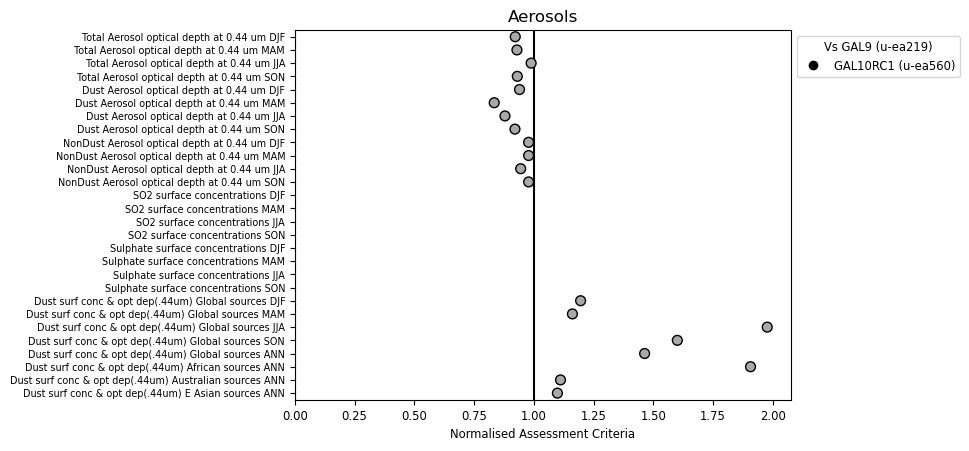
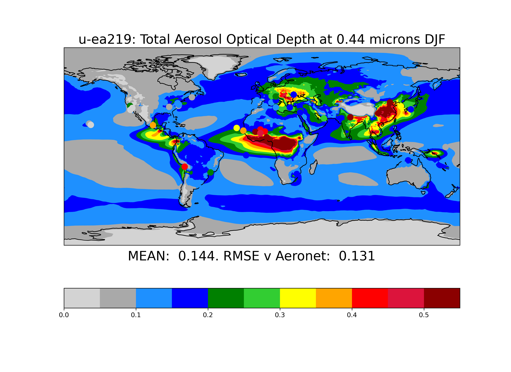
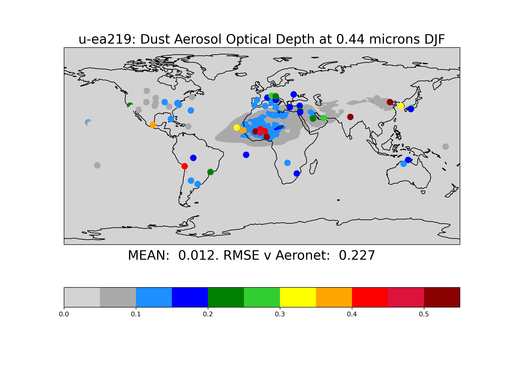
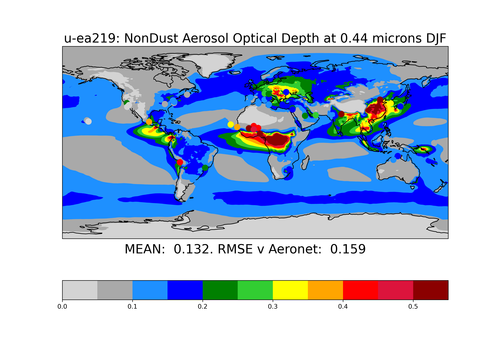
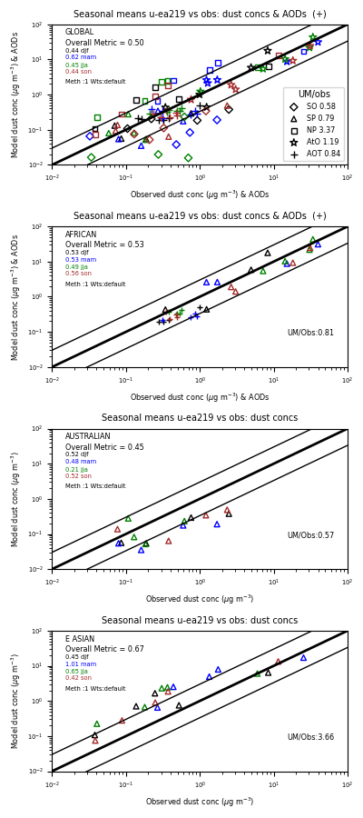

.. _recipes_aerosols:

.. include:: ../../common.txt

Aerosols
========

This recipe is available via |AutoAssess|.

Overview
--------

The ‘aerosols’ component assesses the following parameters/ processess:

1. Sulphur-cycle simulation: SO2 and SO4 concentrations against EMEP measurements
2. Aerosol microphysical processes : Aerosol Optical Depth (AOD) values against AERONET measurements
3. Dust assessment: Emissions, Loadings, Deposition, AOD against U. Miami and AERONET measurements

The scripts can handle the older “CLASSIC” as well as recent “GLOMAP” aerosol schemes without any modification.

Available recipes and diagnostics
---------------------------------

The assessment code is available from the `AutoAssess`_ repository.

Performance metrics:

* S-cycle: Root Mean Square Error (RMSE) of SO2 and SO4 surface concentrations against EMEP and IMPROVE stations for all seasons
* AOD : RMSE of Optical Depth at 440 nanometer against AERONET station measurements for all seasons.
* Dust: Combined assessment of dust surface concentrations against U. Miami and AOD against AERONET at Global (all seasons) as well as Regional (annual) level.

Diagnostics:

* Seasonal mean SO2 and SO4 surface concentrations
* Seasonal mean Aerosol Optical Depth at 440 nm
* Seasonal mean Dust emission, concentration and AOD values

User settings in recipe
-----------------------

There are no user settings for this recipe

Variables
---------

====================================   ============ ==============   ==============================================
Variable/Field name                      realm        frequency        Comment
====================================   ============ ==============   ==============================================
Sulphur Dioxide Mass mixing ratio       Atmosphere   seasonal mean    STASH item: s00i101 (CLASSIC), s34i072 (GLOMAP)
Sulphate Aitken mode mass mix. rat.     Atmosphere   seasonal mean    CLASSIC aerosol scheme only
Sulphate Accum. mode mass mix. rat.     Atmosphere   seasonal mean    CLASSIC only
Sulphate Dissolved mode mmr             Atmosphere   seasonal mean    CLASSIC only

Nucleation mode (soluble) H2SO4 MMR     Atmosphere   seasonal mean    GLOMAP aerosol scheme only
Aitken mode (soluble) H2SO4 MMR         Atmosphere   seasonal mean    GLOMAP only
Accum. mode (soluble) H2SO4 MMR         Atmosphere   seasonal mean    GLOMAP only
Coarse mode (soluble) H2SO4 MMR         Atmosphere   seasonal mean    GLOMAP only

Sulphate Optical Depth in Radiation     Atmosphere   seasonal mean    CLASSIC only
Mineral Dust Optical Depth in Radn.     Atmosphere   seasonal mean    CLASSIC or GLOMAP+CLASSIC-dust 
Sea salt Optical Depth in Radn.         Atmosphere   seasonal mean    CLASSIC only
Soot Optical Depth in Radn.             Atmosphere   seasonal mean    CLASSIC only
Biomass Optical Depth in Radn.          Atmosphere   seasonal mean    CLASSIC only
Biogenic Optical Depth in Radn.         Atmosphere   seasonal mean    CLASSIC only
Foss Fuel Org. Carb OD in Radn.         Atmosphere   seasonal mean    CLASSIC only

Aitken mode (soluble) Optical Depth     Atmosphere   seasonal mean    GLOMAP only
Accum. mode (soluble) Optical Depth     Atmosphere   seasonal mean    GLOMAP only
Coarse mode (soluble) Optical Depth     Atmosphere   seasonal mean    GLOMAP only
Aitken mode (insoluble) Opt. Depth      Atmosphere   seasonal mean    GLOMAP only

Dust mass mixing ratio (6 divisions)    Atmosphere   seasonal mean    CLASSIC or GLOMAP+CLASSIC-dust 
                                                                      STASH codes: s00-i431 to i436
Dust emission flux (6 divisions)        Atmosphere   seasonal mean    STASH: s03-i401 to i406
Dust dry deposition flux (6 div)        Atmosphere   seasonal mean    STASH: s03-i441 to i446, i451 to i456
Dust wet dep flux ls precip (6 div)     Atmosphere   seasonal mean    STASH: s04-i431 to i436
Dust wet dep flux conv prec (6 div)     Atmosphere   seasonal mean    STASH: s05-i281 to i286

Potential temperature                   Atmosphere   seasonal mean
Specific Humidity                       Atmosphere   seasonal mean    
Pressure on Theta levels                Atmosphere   seasonal mean        
Orography                               Atmos/Land   seasonal mean    
====================================   ============ ==============   ==============================================

Observations and reformat scripts
---------------------------------

How to obtain and process the data

(A) EMEP SO2 and Sulphate data (currently Year 2000):

1. Hosted on EBAS server: http://ebas.nilu.no/Default.aspx 

2. For SO2 (Repeat for SO4), Select following values for panels:
   a. Framework           EBAS
   b. Matrix              'air' (SO4 -'aerosol')
   c. Component           'sulphur_dioxide' (SO4: 'sulphate_corrected'/ 'sulphate_total'???)
   d. From, To            2000, 2000

3. Click 'List Datasets'
4. From top line select 'Year [2000]' button
5. List of stations as in /project/cma/scycle_obs/EMEP_SO2(SO4)_2000.txt to try and match existing
6. For multiple instances of a station, select the one with 'Resolution = 1d'
7. 'Download': This will download a .zip file containing one 
   "STNCODE_period_measurementmethod_param_xxx.nas" file for each selected station (nas = NASA AMES format)

8. Processing <<<To be added>>>

(B) IMPROVE Sulphate data (currently Year 2000):

1. http://views.cira.colostate.edu/fed/DataWizard/Default.aspx => and select following options from panels:

   a. Reports           Raw Data
   b. Datasets          IMPROVE Aerosol
   c. Sites             All, or See /project/cma/scycle_obs/IMPROVE_SO4_2000.txt to try and match existing
   d. Parameters        Sulfate (fine)
   e. Dates             Years : as desired or 2000, Months: All
   f. Aggregations      Non-Aggregated
   g. Fields            Dataset,Site,Date,Param,POC,Data Value,Unit,Lat,Long,Elevation
   h. Options           Default (Text file, etc)

2. 'Submit' , then download text file (panel:'Report #N') containing at lot of header lines and then daywise values for each site
3. Process using xxxxx.py : average over each month for each site, multiply by 0.326 (Molwt-S/Molwt-SO4) and
   write out data as ASCII file with columns: "StnCode  SiteName  Lat Long  Alt  Jan Feb ....Dec"

(C) AERONET measurements:

1. http://aeronet.gsfc.nasa.gov => select from menus : DATA => sub-menu Aerosol Optical Depth => Download All sites => (From the table) select Level 2.0 AOD : Monthly Average => download file usually as "AOT_Level2_Monthly.tar.gz".
2. Unzip/untar the Level2 monthly file
3. Copy "/project/cma/aeronet/monthly/quality_sites.pro" and "reader.pro" to download folder.
4. Edit 'quality_sites.pro' to set input folder as 'dir' and execute using IDL.
5. The processed AOD measurements data will be copied to './qadata/' folder with file './qadata.list' containing the names of stations passing quality checks.
6. Provide the path of folder containing the qadata.list and qadata/ as 'aeronet_dir' in aerosols/aero_utils.py

(D) Dust:
<<To be addedd>>>

References
----------

Sulphur cycle:
EMEP:(European Monitoring and Evaluation Programme)
K. Tørseth, W. Aas, K. Breivik, A. M. Fjæraa, M. Fiebig, A. G. Hjellbrekke, C. Lund Myhre, S. Solberg, and
K. E. Yttri; Introduction to the European Monitoring and Evaluation Programme (EMEP) and observed atmospheric composition
change during 1972–2009; Atmos. Chem. Phys., 12, 5447–5481, 2012. http://www.atmos-chem-phys.net/12/5447/2012/, doi:10.5194/acp-12-5447-2012

IMPROVE:(Interagency Monitoring of PROtected Visual Environments)
Malm, W. C., J. F. Sisler, D. Huffman, R. A. Eldred, and T. A. Cahill; Spatial and seasonal trends in particle concentration and optical extinction in the United States, J. Geophys. Res., 99, 1347-1370,(1994)

(Suggested Acknowledgement: IMPROVE is a collaborative association of state, tribal, and federal agencies, and international partners. US Environmental Protection Agency is the primary funding source, with contracting and research support from the National Park Service. The Air Quality Group at the University of California, Davis is the central analytical laboratory, with ion analysis provided by Research Triangle Institute, and carbon analysis provided by Desert Research Institute.)

AERONET: (AErosol RObotic NETwork)
Holben B.N., T.F.Eck, I.Slutsker, D.Tanre, J.P.Buis, A.Setzer, E.Vermote, J.A.Reagan, Y.Kaufman, T.Nakajima, F.Lavenu, I.Jankowiak, and A.Smirnov, 1998: AERONET - A federated instrument network and data archive for aerosol characterization, Rem. Sens. Environ., 66, 1-16. 

Example plots
-------------

   Summary overview of metrics from the Aerosols assessment

   Global surface plot comparing Total Aerosol Optical Depth at 0.44 microns vs AERONET stations

   Global surface plot comparing Dust Aerosol Optical Depth at 0.44 microns vs AERONET stations

   Global surface plot comparing Non-dust Aerosol Optical Depth at 0.44 microns vs AERONET stations

   Scatter plots of Model vs Obs for Dust concentration and AODs on Global and Regional scales over all seasons
