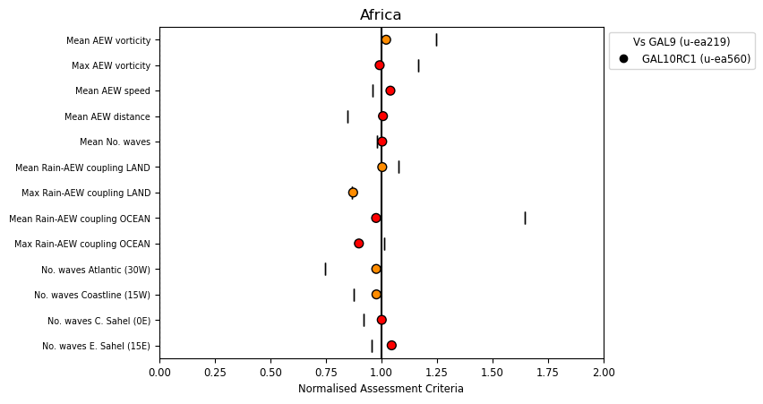
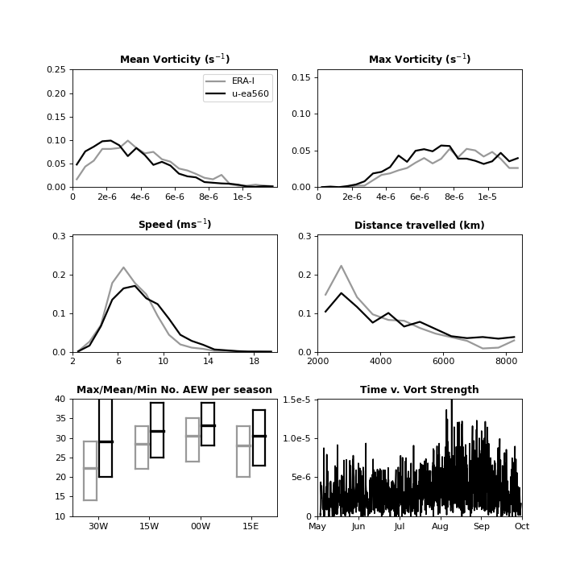
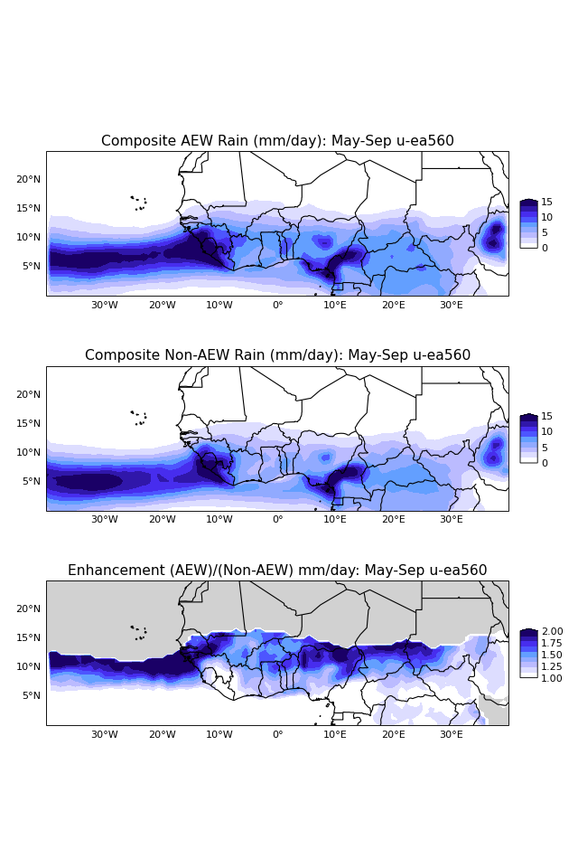
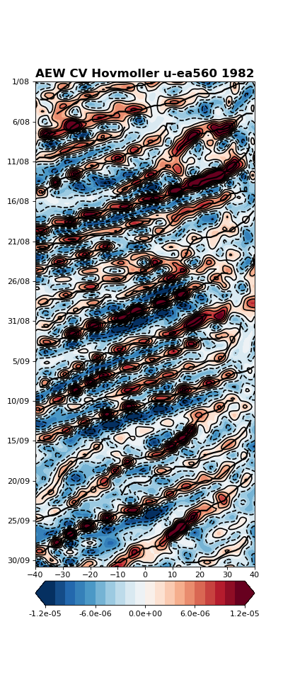
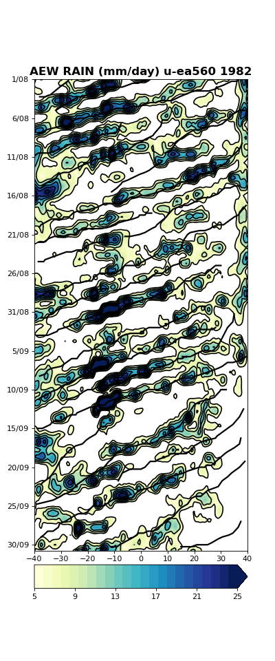

.. _recipes_africa:

.. include:: ../../common.txt

Africa
======

This recipe is available via |AutoAssess|.

Overview
--------

This diagnostic analyses African Easterly Waves (AEW) during the months May to September.

(Possibly West African Monsoon?)

Available recipes and diagnostics
---------------------------------

The assessment code is available from the `AutoAssess`_ repository.

User settings in recipe
-----------------------

There are no user settings for this recipe

Variables
---------

* pr (atmos, daily mean, longitude latitude time)
* ua (700) (atmos, daily mean, longitude latitude time)
* va (700) (atmos, daily mean, longitude latitude time)

Observations and reformat scripts
---------------------------------

* ECMWF Reanalysis (ERA-Interim?) (ua, va)
* MERRA (ua, va)

References
----------

Bain, C.L., K. Williams, S. Milton, J. Heming (2013): 
Tracking African Easterly Waves in Met Office models 
QJRMS

Example plots
-------------

   This is the summary overview of metrics from the Africa assessment.

   This displays statistics of various aspects of African Easterly Waves.

   This highlights the coupling between AEWs and rainfall.

   This shows a hovmoller of curvature vorticity overlaid with AEW tracks.

   This shows a hovmoller of rainfall overlaid with AEW tracks.
