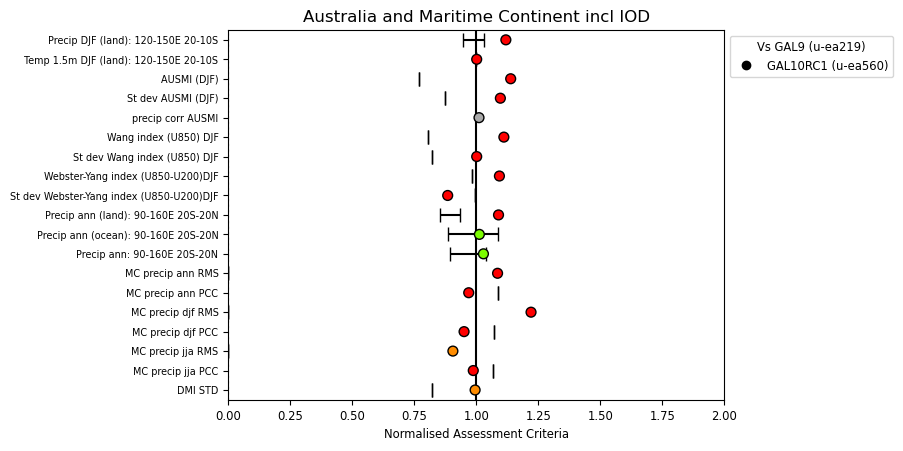
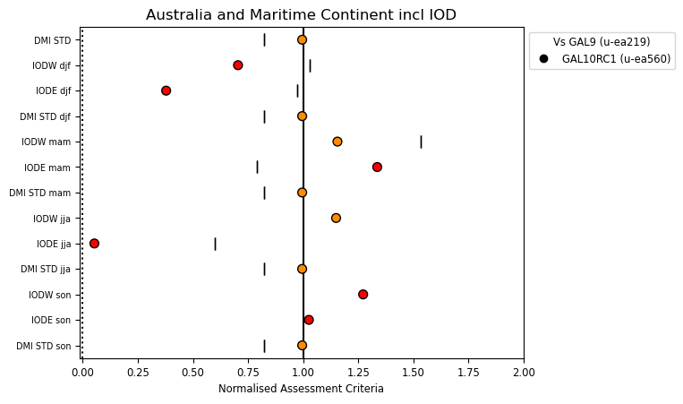
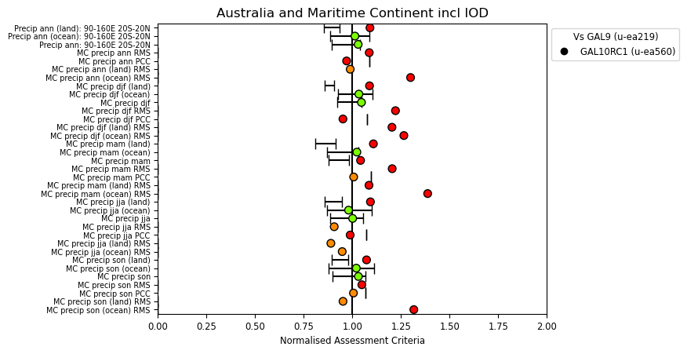
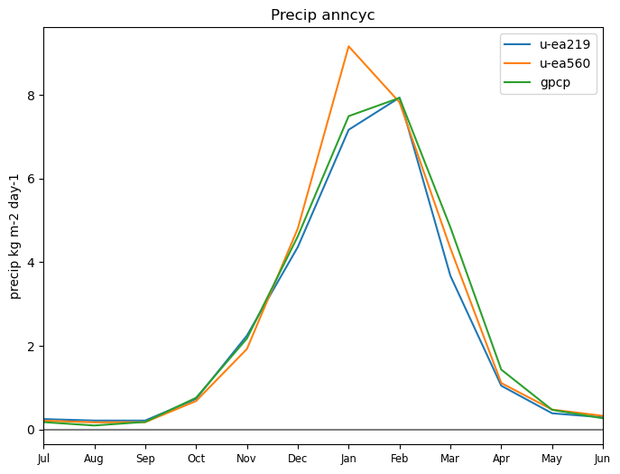
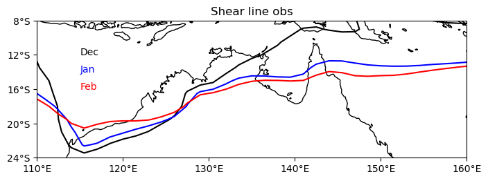
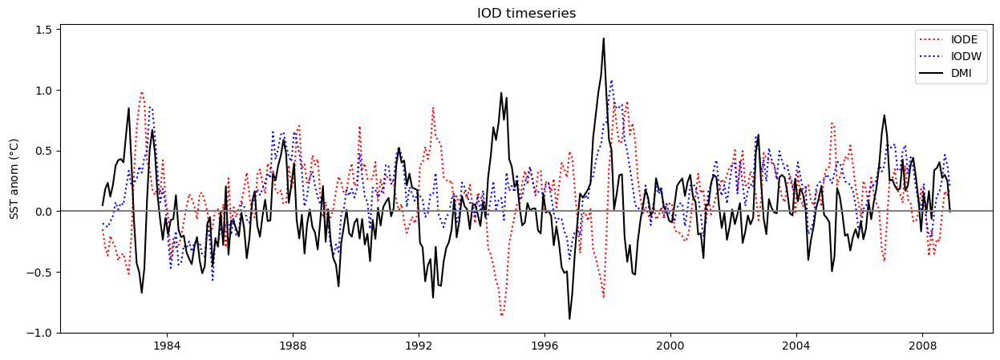

.. _recipes_australia:

.. include:: ../../common.txt

Australia and Maritime Continent
================================

This recipe is available via |AutoAssess|.

Overview
--------

Assessment of the northern Austrlia (NAus) and Maritime Continent (MC) regions. Also includes some analysis of the Indian Ocean Dipole.

The metrics include:
NAus monsoon region;
Monsoon metrics;
Annual cycles;
Maritime continent averages;
RMSE and PCC for seasonal rainfall over MC;
IOD metrics.

Land fraction information is taken from the model files.

Area-averaged metrics are calculated on the native grid (model and obs).
Model and observational data are regridded to the coarsest grid (variable dependent) for plotting and RMS/PCC calculation.  This means plots from a N216 model will differ when comparing with another N216 or N96 but metrics should stay the same.
Number of vectors (quiver plots) plotted is resolution dependentso higher resolution doesn't mean more vectors.

Maritime continent domain is 90-160E, 20S-20N to be consistent with the TerraMaris project (Matthews).

Inclusion of JJA fields and metrics is based on Toh et al. (2017) who showed higher biases during this season in the MC.

Diurnal cycle analysis as in global troposphere section but foccussing on land in the maritime continent.  The core code remains the same so is regridded to N96.

IOD metrics, timeseries and seasonal averages.  This is only really important for coupled model analysis.  DMI = IODW - IODE SST anomalies. where IODW=50-70E, 10S-10N. IODE=90-110E, 10S-eq. See McKenna et al. 2020.

Add metrics covering southern Aus in future?

Available recipes and diagnostics
---------------------------------

The assessment code is available from the `AutoAssess`_ repository.

Overall performance metrics:

* NAus (land) DJF precip vs. GCPC/CMAP
* NAus (land) DJF temp vs. CRU
* mean AUSMI (DJF) vs ERA-I
* Standard deviation AUSMI (DJF) vs ERA-I
* Correlation of precip with AUSMI (DJF)
* Wang index (U850)
* St dev Wang index
* Webster-Yang index (U850-U200)
* St dev Webster-Yang index
* MC precip land (ann) vs GPCP
* MC precip ocean (ann) vs GPCP
* MC precip (ann) vs GPCP
* RMS MC precip (ann)
* PCC MC precip (ann)
* RMS MC precip (DJF)
* PCC MC precip (DJF)
* RMS MC precip (JJA)
* PCC MC precip (JJA)
* St dev DMI (IODW-IODE)

Diagnostics (Australian region):

* Annual cycle precip
* Annual cycle AUSMI
* DJF precipitation
* DJF temperature
* Location of the monsoon shear line (u925 = 0) based on Colman et al., (2011).
* DJF MSLP and 850 hPa winds

Maritime continent precipitation metrics:

* Precip ann (land): 90-160E 20S-20N
* Precip ann (ocean): 90-160E 20S-20N
* Precip ann: 90-160E 20S-20N
* MC precip ann RMS
* MC precip ann PCC
* MC precip ann (land) RMS
* MC precip ann (ocean) RMS
* MC precip djf (land)
* MC precip djf (ocean)
* MC precip djf
* MC precip djf RMS
* MC precip djf PCC
* MC precip djf (land) RMS
* MC precip djf (ocean) RMS
* MC precip mam (land)
* MC precip mam (ocean)
* MC precip mam
* MC precip mam RMS
* MC precip mam PCC
* MC precip mam (land) RMS
* MC precip mam (ocean) RMS
* MC precip jja (land)
* MC precip jja (ocean)
* MC precip jja
* MC precip jja RMS
* MC precip jja PCC
* MC precip jja (land) RMS
* MC precip jja (ocean) RMS
* MC precip son (land)
* MC precip son (ocean)
* MC precip son
* MC precip son RMS
* MC precip son PCC
* MC precip son (land) RMS
* MC precip son (ocean) RMS

Maritime continent diagnostics:

* Zonal mean MC precip (80-160E) based on Toh et al., (2017).
* JJA precipitation
* Diurnal cycle DJF and JJA (phase and amplitude)

Indian Ocean Dipole metrics (vs HadISST):

* DMI STD
* IODW djf
* IODE djf
* DMI STD djf
* IODW mam
* IODE mam
* DMI STD mam
* IODW jja
* IODE jja
* DMI STD jja
* IODW son
* IODE son
* DMI STD son

Indian Ocean Dipole diagnostics:

* Annual cycle IODW
* Annual cycle IODE
* Annual cycle standard deviation of DMI
* Timeseries IODW, IODE, DMI
* SON mean SST and surface wind stress

User settings in recipe
-----------------------

There are no user settings for this recipe

Variables
---------

============================  ================== ============== ==============================================
Variable/Field name           realm              frequency      Comment
============================  ================== ============== ==============================================
Total precipitation rate      Atmosphere         monthly mean
Zonal (u) wind speed          Atmosphere         monthly mean   925, 850 and 200 hPa.
Meridinal (v) wind speed      Atmosphere         monthly mean   850 hPa only
Air temperature at 1.5m       Atmosphere         monthly mean
Mean sea level pressure       Atmosphere         monthly mean
surface temperature           Atmosphere         monthly mean
surface wind stress (x-comp)  Atmosphere         monthly mean   1st level only (surface)
surface wind stress (y-comp)  Atmosphere         monthly mean   1st level only (surface)
============================  ================== ============== ==============================================

Observations and reformat scripts
---------------------------------

* GPCP2 monthly data (Adler et al., 2003): Jan 1979 - Dec 2006, 2.5x2.5 deg resolution, units: kg/m2/day.
* CMAP/O monthly data (Xie and Arkin, 1997): Jan 1979 - Dec 2001, 2.5x2.5 deg resolution, units: kg/m2/day.
* TRMM data (for diurnal cycle)
* ERA-Interim monthly data (Dee et al., 2011)
* MERRA monthly data (Rienecker et al., 2011)
* HadISST and CRU from  Met Office

References
----------

Adler, R.F. et al., 2003: The Version 2 Global Precipitation Climatology Project (GPCP) Monthly Precipitation Analysis (1979-Present). J. Hydrometeor., 4,1147-1167.

Colman, R. A., A. F. Moise, and L. I. Hanson (2011), Tropical Australian climate and the Australian monsoon as simulated by 23 CMIP3 models, J. Geophys. Res., 116, D10116, doi:10.1029/2010JD015149.

Kajikawa, Y., Wang, B. and Yang, J. (2010), A multi‐time scale Australian monsoon index. Int. J. Climatol., 30: 1114-1120. doi:10.1002/joc.1955

Narsey, S.Y., Brown, J. R.,Colman,R.A., Delage, F., Power, S. B., Moise, A. F., & Zhang, H. (2020). Climate change projections for the Australian monsoon from CMIP6 models. Geophysical Research Letters, 47, e2019GL086816.

McKenna, S., Santoso, A., Gupta, A.S. et al. Indian Ocean Dipole in CMIP5 and CMIP6: characteristics, biases, and links to ENSO. Sci Rep 10, 11500 (2020).

Toh, Y.Y., Turner, A.G., Johnson, S.J. et al. Maritime Continent seasonal climate biases in AMIP experiments of the CMIP5 multimodel ensemble. Clim Dyn 50, 777–800 (2018).

Xie and Arkin 1997. Global precipitation: a 17-year monthly analysis based on gauge observations, satellite estimates and numerical model outputs. BAMS vol 78, 2539-2558.

Example plots
-------------

   Summary overview of metrics from the Australia assessment

   Indian Ocean Dipole metrics

   Maritime Continent metrics

   Annual cycle of precipitation over NAus land

   Location of monsoon shearline (ERA-Interim)

   Timeseries of IOD (IODW, IODE, DMI) from HadISST
