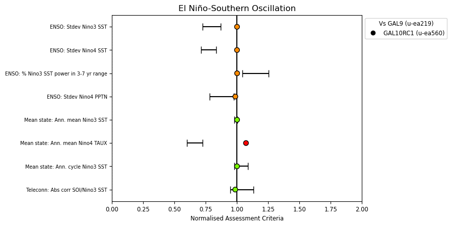
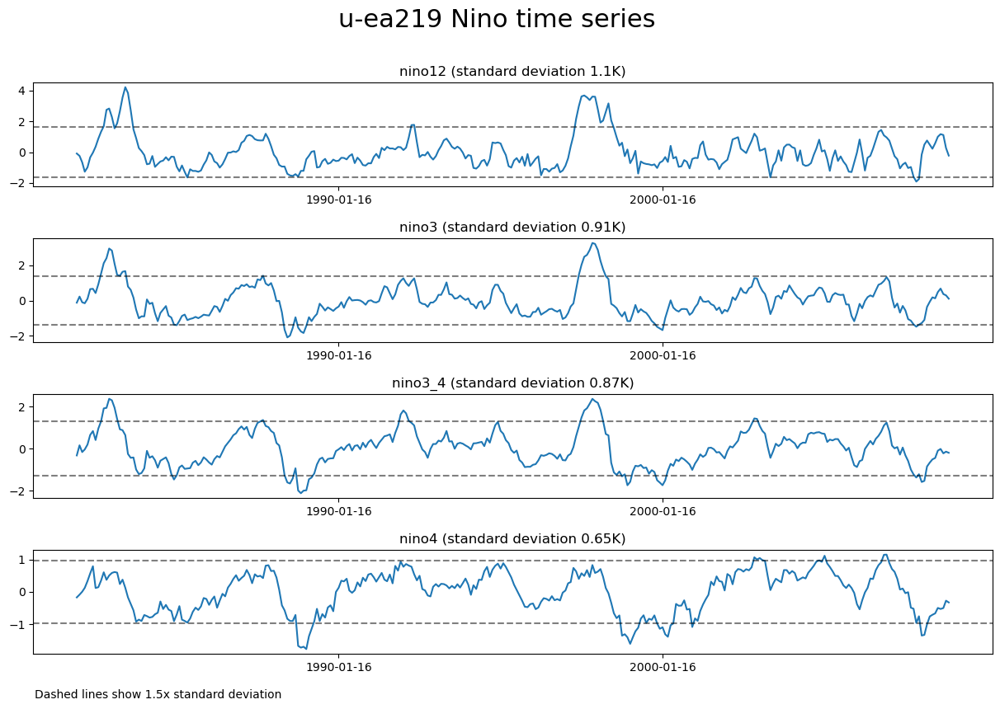
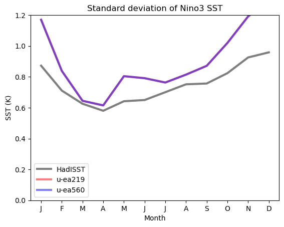
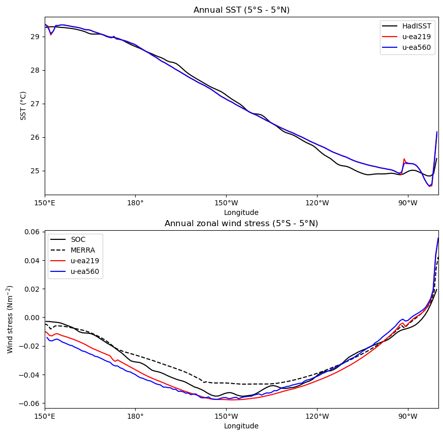
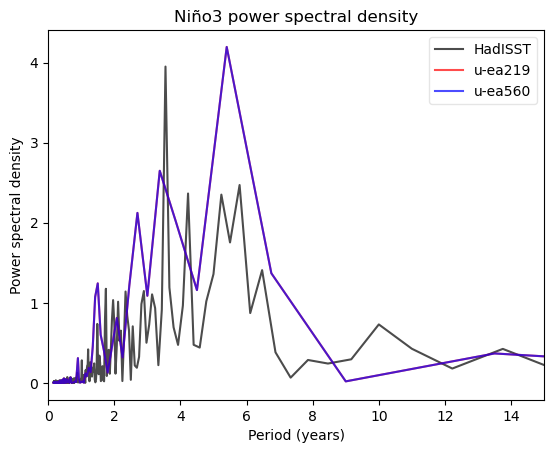
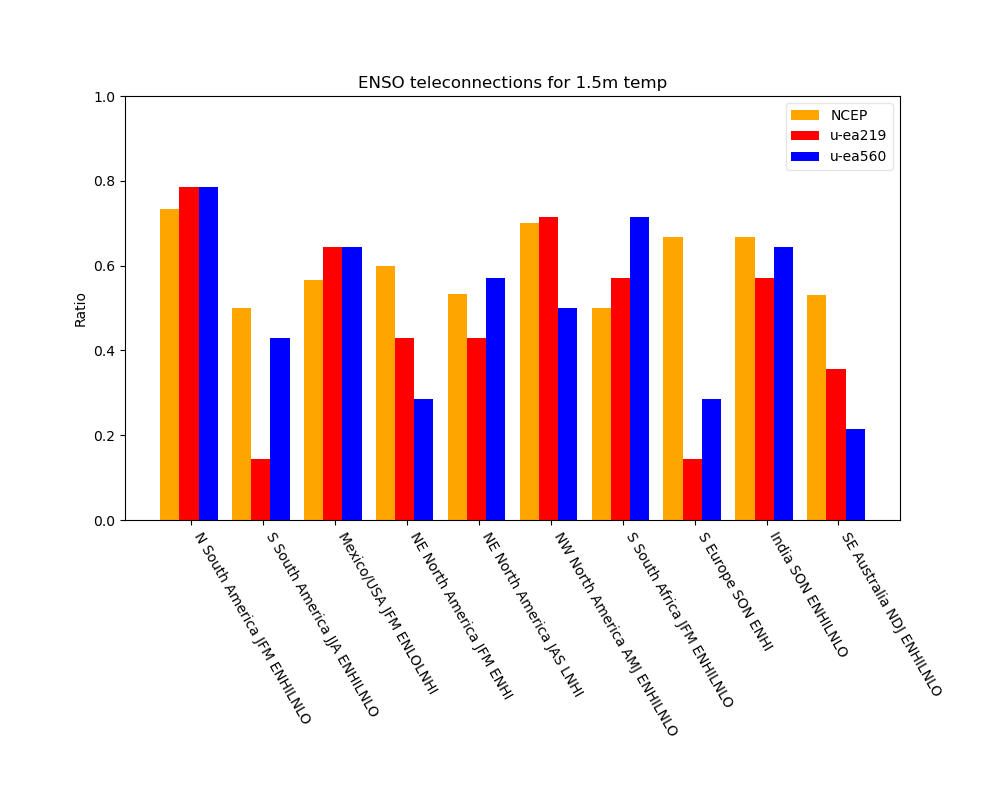
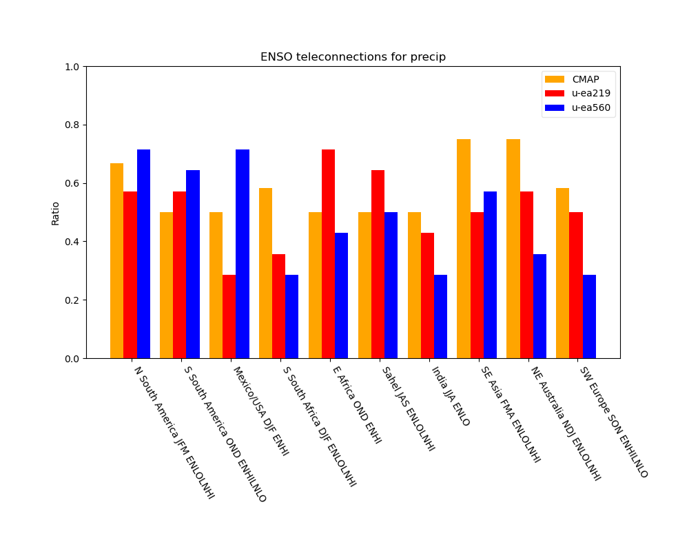

.. _recipes_enso:

.. include:: ../../common.txt

El Niño-Southern Oscillation
============================

This recipe is available via |AutoAssess|.

Overview
--------

ENSO

Available recipes and diagnostics
---------------------------------

The assessment code is available from the `AutoAssess`_ repository.

Definition of Nino regions: Nino 1+2 (0-10S, 90W-80W), Nino 3 (5N-5S, 150W-90W), Nino 3.4 (5N-5S, 170W-120W), Nino 4 (5N-5S, 160E-150W)

Performance metrics:

* Standard deviation of Nino3 sea surface temperature (SST) anomalies
* Standard deviation of Nino4 SST anomalies
* Nino3 SST anomaly power spectrum in 3-7 year frequency range
* Standard deviation of Nino4 precipitation anomalies
* Annual mean Nino3 SST
* Annual mean Nino4 zonal wind stress (TAUX)
* Standard deviation of Nino3 SST annual cycle
* Correlation of Nino3 SST and Southern Oscillation Index (mean sea level pressure anomaly, Tahiti minus Darwin)

Diagnostics:

* Time series for sea surface temperature for areas Nino1+2, Nino3, Nino3.4 and Nino4
* Annual mean sea surface temperature (5N-5S) and zonal wind stress (5N-5S) for Pacific longitudes
* Seasonal cycle of standard deviation of Nino3 sea surface temperature "phase locking"
* Nino3 sea surface temperature power spectrum
* Composite sea surface temperature (tropical Pacific) for DJF and JJA for El Nino (Nino3.4>0.8) and La Nina (Nino3.4<0.8) composites
* Composite MSLP anomalies (global) for DJF and JJA for El Nino and La Nina
* Composite MSLP anomalies (N. Hem) for JFM (late winter) for El Nino and La Nina
* Composite precipitation anomalies (global) for DJF and JJA for El Nino and La Nina
* Likelihood of impact for selected regions for 1.5m temperature and precipitation

User settings in recipe
-----------------------

There are no user settings for this recipe

Variables
---------

===========================   ================== ==============
Variable/Field name           realm              frequency
===========================   ================== ==============
Sea surface temperature       Atmosphere         monthly mean
TAUX                          Atmosphere         monthly mean
Precipitation                 Atmosphere         monthly mean
Mean sea level pressure       Atmosphere         monthly mean
1.5m temperature              Atmosphere         monthly mean
===========================   ================== ==============

Observations and reformat scripts
---------------------------------

Sea surface temperature: HadISST
Zonal mean wind stress: NOC, MERRA
Mean sea level pressure: NCEP reanalysis
Precipitation: CMAP, GPCP
Near surface temperature: NCEP reanalysis

How to obtain the data:

All data can be downloaded free of charge

References
----------

Bellenger, H., Guilyardi, É., Leloup, J., Lengaigne, M. and Vialard, J., 2014. ENSO representation in climate models: from CMIP3 to CMIP5. Climate Dynamics, 42(7-8), pp.1999-2018.

Davey, M. K., A. Brookshaw, and S. Ineson, 2014: The probability of the impact of ENSO on precipitation and near-surface temperature. Climate Risk Management, 1, 5-24, doi:10.1016/j.crm.2013.12.002.

Example plots
-------------

   Summary overview of metrics from the ENSO assessment

   ENSO Timeseries

   ENSO Phaselocking

   SST and Surface Stress

   Power Spectral Density

   Teleconnections using 1.5m temperature

   Teleconnections using precipitation
