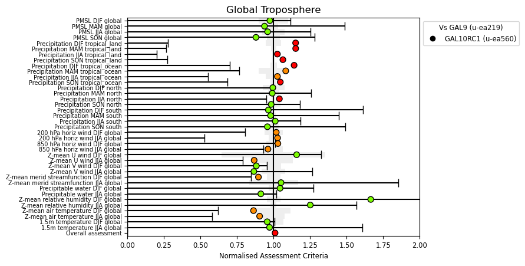
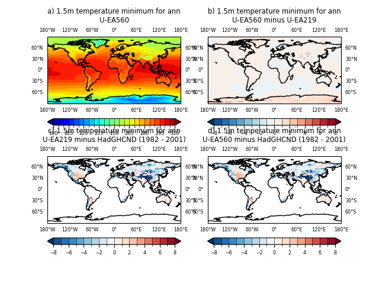
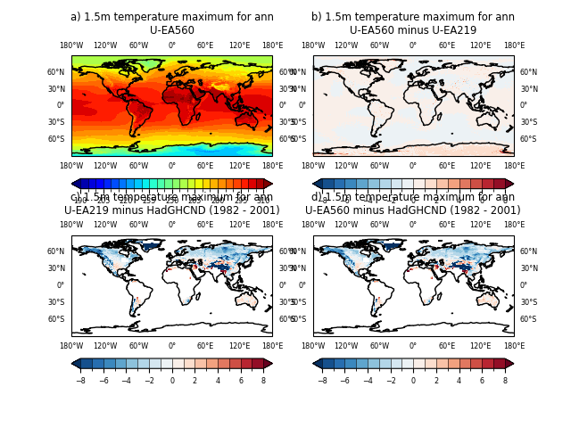
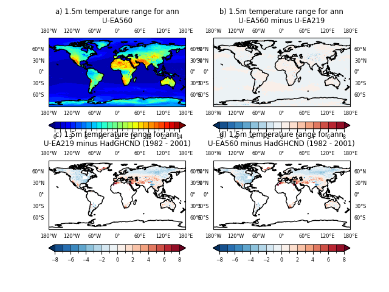

.. _recipes_globaltrop:

.. include:: ../../common.txt

Global Troposphere
==================

This recipe is available via |AutoAssess|.

Overview
--------

Summary of global tropospheric performance looking at general circulation
diagnostics of MSLP, U, V, T, RH and precipitation. Also looks at range of 1.5m
temperatures.

Includes diurnal cycle of precipitation and OLR compared to TRMM and CERES.

Available recipes and diagnostics
---------------------------------

The assessment code is available from the `AutoAssess`_ repository.

User settings in recipe
-----------------------

There are no user settings for this recipe

Variables
---------

* tas (mean/min/max)
* precip (mean/diurnal)
* olr (diurnal)
* msl
* ua/va/ta/rh
* land area fraction
* Total column dry/wet/qcl/qcf

Observations and reformat scripts
---------------------------------

* HadGHCND (tas min and max)
* TRMM (precip)
* CERES (olr)

References
----------

There are no references for this assessment.

Example plots
-------------

   Summary overview of metrics from the Global Troposphere assessment

   Minimum 1.5m temperature comparisons

   Maximum 1.5m temperature comparisons

   Range of 1.5m temperature comparisons
