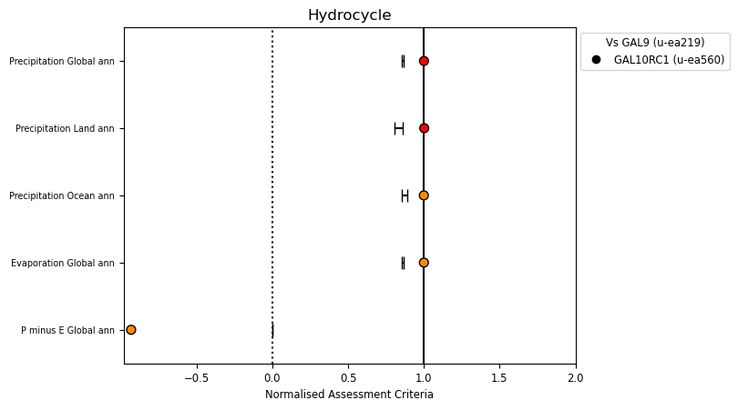
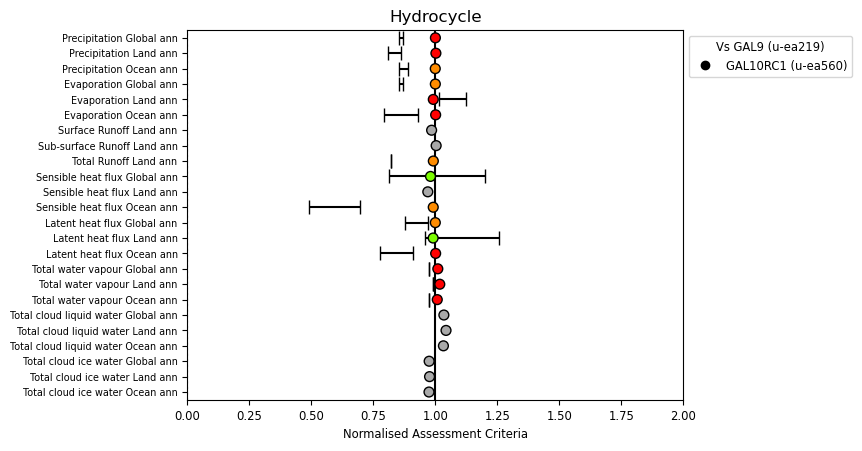
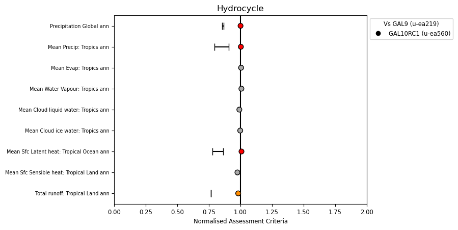
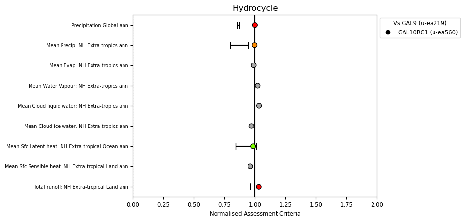
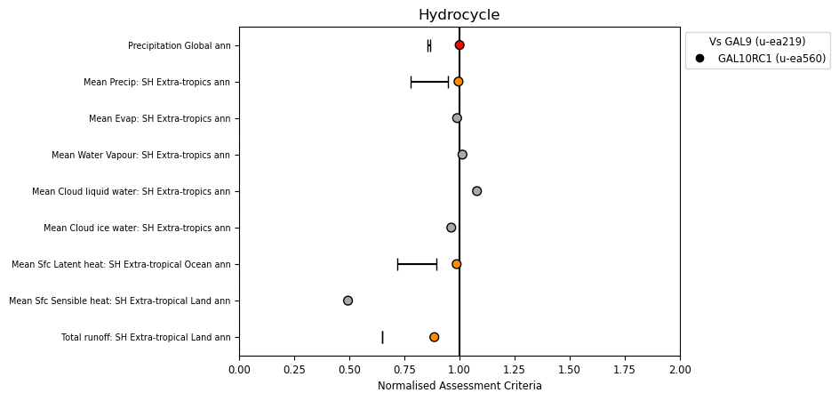
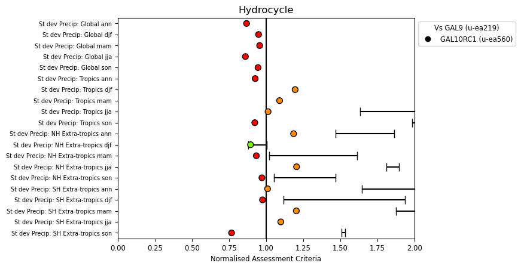
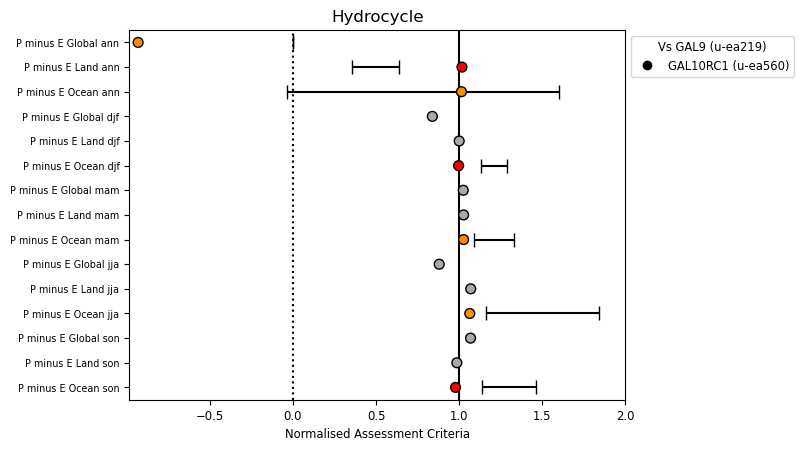

.. _recipes_hydrocycle:

.. include:: ../../common.txt

Hydrocycle
==========

This recipe is available via |AutoAssess|.

Overview
--------

Metrics are based on global and regional means.

Our aim is to examine where water is in the system. The metrics include:

* Global, all-land and all-ocean quantities;
* Values from annual and seasonal climatologies;
* Regional averages (Tropics (30S-30N) and NH, SH extra-tropics);
* Inter-annual standard deviation of rainfall only, for global and regional means.

For runoff, the observations only extend to 60S so the SH region is limited to this latitude.

Global and regional averages are always calculated at native grid resolution (to avoid loss of accuracy due to re-gridding, which could affect P-E calculations, as these should tend to zero).

Land fraction information (on the native grid) is taken from the run files (if available) or from standard files (in general/control/extras_file.dat). Weighted averages for land-only and sea-only are calculated.

For some quantities there are single observed estimates, for some there is a range of estimates from different datasets, and for some there is no observational constraint at all. Nevertheless, they are included for completeness and in order to allow model to model comparison of the whole hydrological cycle.

For the observations, there is code to calculate some of the values from existing datasets while other values are taken from literature and simply written to the csv file. Where there are more than two values, the max/min range is used.

Note that annual means run from 1st December to 30th November. Missing data tolerance is set to zero.

Available recipes and diagnostics
---------------------------------

The assessment code is available from the `AutoAssess`_ repository.

Performance metrics:

* Global, all-land and all-ocean quantities;
* Values from annual and seasonal climatologies;
* Regional averages (Tropics (30S-30N) and NH, SH extra-tropics);
* Inter-annual standard deviation of rainfall only, for global and regional means.

Diagnostics:

* Precipitation
* Evaporation
* Runoff
* Sensible heat flux
* Latent heat flux
* Total water vapour
* Total cloud liquid water
* Total cloud ice water

User settings in recipe
-----------------------

There are no user settings for this recipe

Variables
---------

========================= ======== ==========  =================================================
Variable/Field name       realm    frequency   Comment
========================= ======== ==========  =================================================
Precipitation             Global   seasonal
Evaporation               Global   seasonal
Runoff                    Global   seasonal    Limited to north of 60S. Observational constraint only for annual.
Sensible heat flux        Global   seasonal
Latent heat flux          Global   seasonal
Total water vapour        Global   seasonal
Total cloud liquid water  Global   seasonal    For monitoring only; no observational constraint
Total cloud ice water     Global   seasonal    For monitoring only; no observational constraint
========================= ======== ==========  =================================================

Observations and reformat scripts
---------------------------------

======================================================  ==================  ====================================================================================================================================
Precipitation (global, regional, seasonal, IAV):                            Calculated from CMAP, GPCP2; see below for datasets.
Evaporation Global (annual only):                                           Taken as the same as precipitation (so that obs have P-E balance).
Evaporation Land (annual only):                         1.56 +/- 0.2 mm/d   Range of values from Mueller et al. 2011.
Evaporation Ocean (global, regional, seasonal):                             Calculated from NOCS2.0 only; see below for dataset information.
Evaporation Ocean (global, annual-only):                2.97 mm/d           Fixed value taken from Yu 2007 (though note large decadal variation); second value calculated from NOCS2.0
Total Runoff Land (global, regional, annual-only):                          Calculated from Fekete et al. (2002) annual means only and limited to north of 60S.
Sensible heat flux Global (annual only)                 15.7 to 18.9 W/m2   Range of estimates quoted in Trenberth et al (2009)
Sensible heat flux Land (annual only)                   26.0 to 47.0 W/m2   Jimenez et al (2011) (41.0 +/- 6 W/m2); excl Antarctic, Greenland; and Trenberth et al. (2009)
Sensible heat flux Ocean (global, regional, seasonal)                       Calculated from COADS (DaSilva et al 1994) and NOCS2.0
Sensible heat flux Ocean (global, annual):                                  Fixed value 7 W/m2  Taken from SOC (Josey 1999); Value of 12 W/m2 given by Trenberth et al. (2009). Also use values calculated from NOCS2.0 and COADS.
Latent heat flux Global (annual only)                   80.0 to 83.0 W/m2   Range of estimates quoted in Trenberth et al (2009)
Latent heat flux Land (annual only)                     38.0 to 51.0 W/m2   Jimenez et al (2011) (45.0 +/- 6 W/m2); excl Antarctic, Greenland; also Trenberth et al. (2009) who quote 38.5 W/m2.
Latent heat flux Ocean (global, regional, seasonal)                         Calculated from COADS (DaSilva et al 1994) and NOCS2.0
Total water vapour Global (annual only)                 24.2  mm            Fixed value from Trenberth (2011) (SSM/I)
Total water vapour Land (annual only)                   18.5  mm            Fixed value from Trenberth (2011) (SSM/I)
Total water vapour Ocean (annual only)                  26.6  mm            Fixed value from Trenberth (2011) (SSM/I)
Total cloud liquid water Global                         None
Total cloud liquid water Land                           None
Total cloud liquid water Ocean                          None
Total cloud ice water Global                            None
Total cloud ice water Land                              None
Total cloud ice water Ocean                             None
P minus E Global                                        0.0
P minus E Land                                                              Using P and E ranges above
P minus E Ocean                                                             Using P and E ranges above
======================================================  ==================  ====================================================================================================================================

References
----------

Adler, R.F. et al., 2003: The Version 2 Global Precipitation Climatology Project (GPCP) Monthly Precipitation Analysis (1979-Present). J. Hydrometeor., 4,1147-1167.

Berry, D., Kent, E.C. (2014): NOCS 2.0: National Oceanography Centre Southampton Surface Flux Climatology (version 2.0). NCAS British Atmospheric Data Centre. http://catalogue.ceda.ac.uk/uuid/21b5b970a6844d72afa4b2c551944d9b

Da Silva, A M, C C Young and S Levitus (1994): Atlas of Surface Marine data (1994). Vol 1: Algorithms and Procedures.

Fekete, B. M., et al. (2002) High-resolution fields of global runoff combining observed river discharge and simulated water balances, Global Biogeochem. Cycles, 16(3), doi:10.1029/1999GB001254,2002.

Josey, Simon A., Kent, Elizabeth C. and Taylor, Peter K. (1999) New insights into the ocean heat budget closure problem from analysis of the SOC air-sea flux climatology. Journal of Climate, 12, (9), 2856-2880.

Mueller, B., et al. (2011), Evaluation of global observations-based evapotranspiration datasets and IPCC AR4 simulations, Geophys. Res. Lett., 38, L06402, doi:10.1029/2010GL046230.

Trenberth, K.E. (2011) Changes in precipitation with climate change. Clim Res 47:123-138

Trenberth, K.E., J.T. Fasullo, and J. Kiehl (2009): Earth's Global Energy Budget. Bulletin of the American Meteorological Society, Vol 90, No 3, pp 311-323.

Xie and Arkin (1997). Global precipitation: a 17-year monthly analysis based on gauge observations, satellite estimates and numerical model outputs. BAMS vol 78, 2539-2558.

Yu, L. (2007): Global Variations in Oceanic Evaporation (1958-2005): The Role of the Changing Wind Speed. J. Climate, 20:21, 5376-5390

Example plots
-------------

   Summary overview of metrics from the Hydrocycle assessment

   Global hydrology metrics

   Tropical hydrology metrics

   Northern Hemisphere hydrology metrics

   Southern Hemisphere hydrology metrics

   Interannual standard deviation metrics

   P minus E metrics
