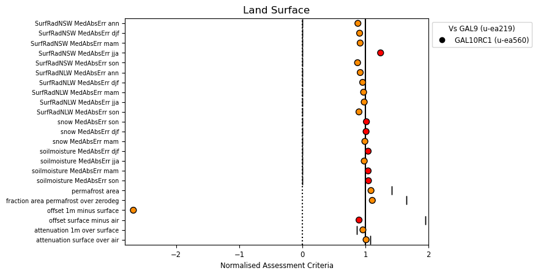
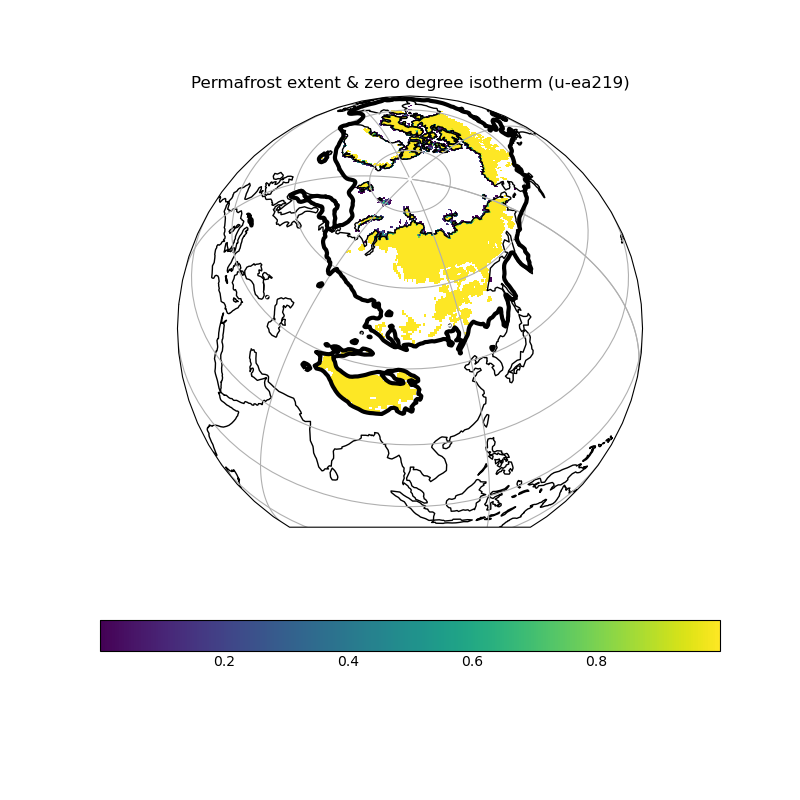
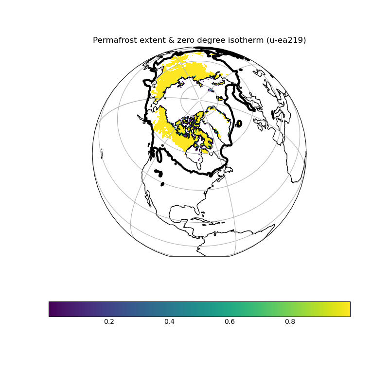

.. _recipes_land_surface:

.. include:: ../../common.txt

Land Surface
============

This recipe is available via |AutoAssess|.

Overview
--------

Permafrost thaw is an important impact of climate change, and is the source of a
potentially strong Earth system feedback through the release of soil carbon into
the atmosphere. This recipe provides metrics that evaluate the climatological
performance of models in simulating soil temperatures that control permafrost.

The simulation of surface radiation is central to all aspects of model performance,
and can often reveal compensating errors which are hidden within top of atmosphere
fluxes. This recipe provides metrics that evaluate the skill of models’ spatial
and seasonal distribution of surface shortwave and longwave radiation against the
CERES EBAF satellite dataset.

Soil moisture is a critical component of the land system, controling surface energy
fluxes in many areas of the world. This recipe provides metrics that evaluate the
skill of models’ spatial and seasonal distribution of soil moisture against the
ESA CCI soil moisture ECV.

Available recipes and diagnostics
---------------------------------

The assessment code is available from the `AutoAssess`_ repository.

Note that there are various Land Surface recipes that have been migrated to
|ESMValTool| as an example of the process of migrating AutoAssess assessments. These
are:

* `Land-surface Permafrost`_
* `Land-surface Surface Radiation`_
* `Land-surface Soil Moisture`_

User settings in recipe
-----------------------

There are no user settings for this recipe

Variables
---------

* tas (atmos, monthly mean, longitude latitude time)
* tsl (land, monthly mean, longitude latitude time)
* mrsos (land, monthly mean, longitude latitude time)
* rsns (atmos, monthly mean, longitude latitude time)
* rlns (atmos, monthly mean, longitude latitude time)
* sftlf (mask, fixed, longitude latitude)

Observations and reformat scripts
---------------------------------

* 2001-2012 climatologies (seasonal means) from CERES-EBAF Ed2.7.
* 1999-2008 climatologies (seasonal means) from ESA ECV Soil Moisture Dataset v1. Produced by the `ESA CCI soil moisture project`_.

References
----------

See |ESMValTool| recipes linked above.

Example plots
-------------

   Summary overview of metrics from the Land Surface assessment

   Permafrost extent over Asia

   Permafrost extent over North America
