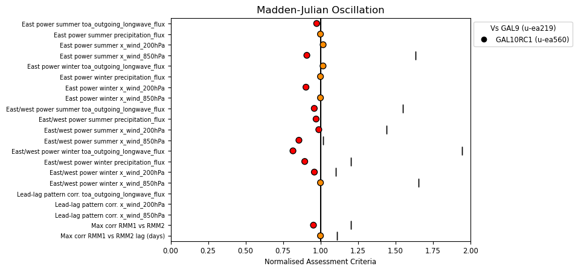
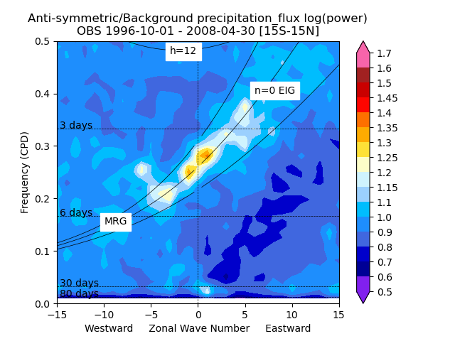
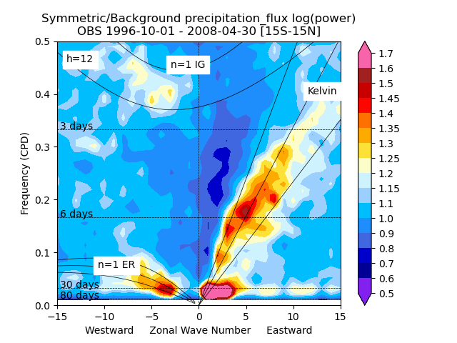
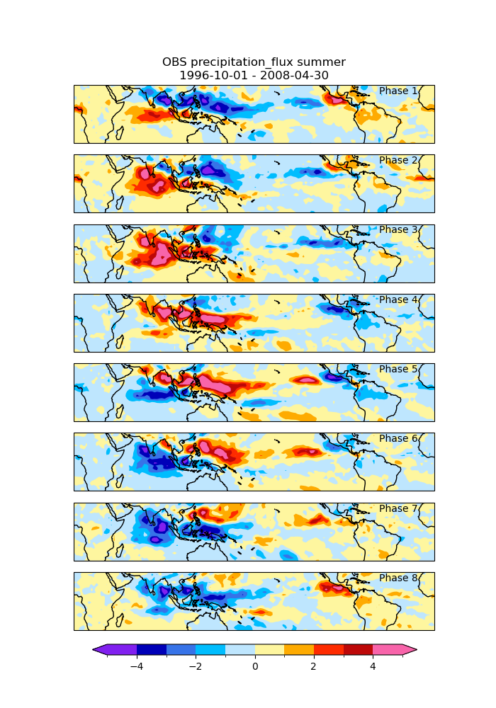
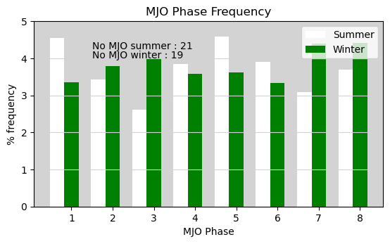

.. _recipes_mjo:

.. include:: ../../common.txt

Madden-Julian Oscillation
=========================

This recipe is available via |AutoAssess|.

Overview
--------

MJO

Available recipes and diagnostics
---------------------------------

The assessment code is available from the `AutoAssess`_ repository.

User settings in recipe
-----------------------

There are no user settings for this recipe

Variables
---------

* precip (daily)
* ua 850hPa (daily)
* ua 200hPa (daily)
* olr (daily)

Observations and reformat scripts
---------------------------------

* xxx

References
----------

* xxx

Example plots
-------------

   Summary overview of metrics from the MJO assessment

   Anti-symmetric/Background log(power) for precipitation

   Symmetric/Background log(power) for precipitation

   Wheeler-Hendon Phase composites for precipitation

   MJO Phase frequencies
