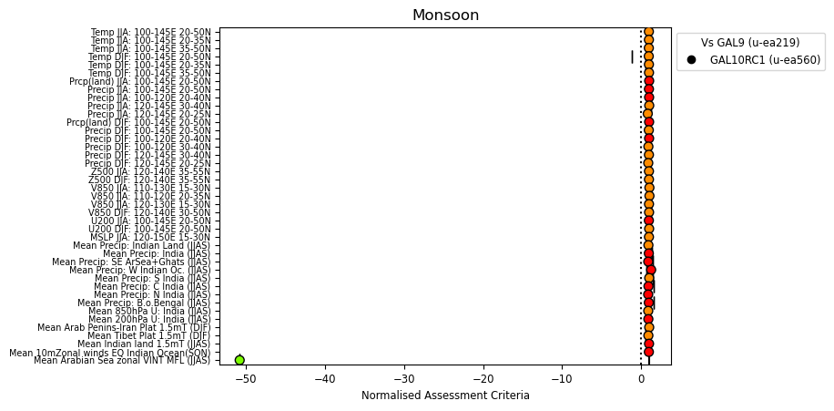
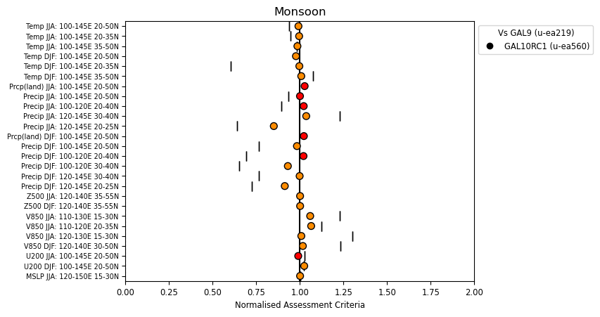
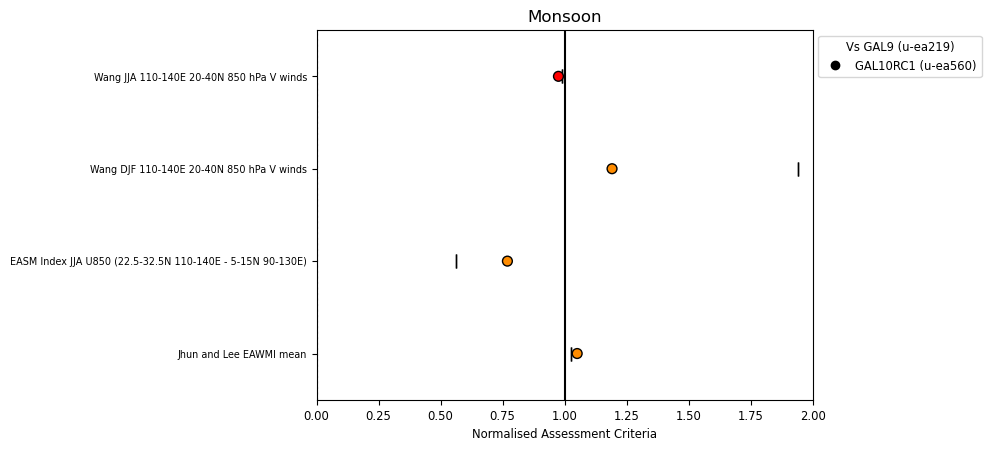
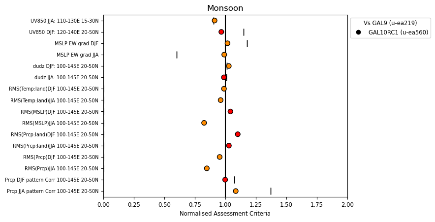
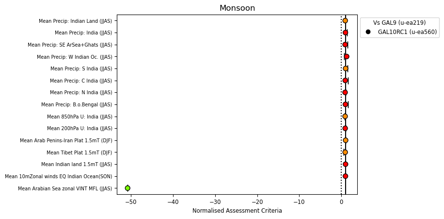
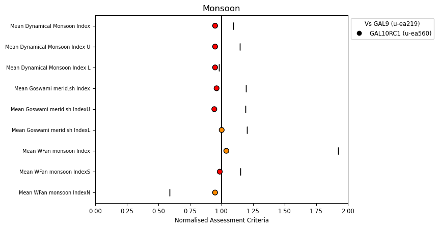
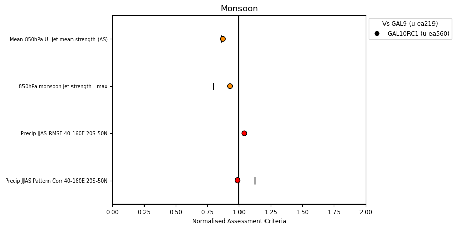

.. _recipes_monsoon:

.. include:: ../../common.txt

Monsoon
=======

This assessment is available via |AutoAssess|.

Overview
--------

This diagnostic analyses the South and East Asian monsoon.

Available recipes and diagnostics
---------------------------------

The assessment code is available from the `AutoAssess`_ repository.

User settings in recipe
-----------------------

There are no user settings for this recipe

Variables
---------

Fixed Variables:

* sftlf (atmos, fixed, longitude latitude)

Daily Mean Variables:

* pr (atmos, daily mean, longitude latitude time)
* ua (850) (atmos, daily mean, longitude latitude time)
* va (850) (atmos, daily mean, longitude latitude time)

Monthly Mean Variables:

* pr (atmos, monthly mean, longitude latitude time)
* ua (850, 200) (atmos, monthly mean, longitude latitude plev time)
* va (850, 200) (atmos, monthly mean, longitude latitude plev time)
* psl (atmos, monthly mean, longitude latitude time)
* tas (atmos, monthly mean, longitude latitude time)
* uas (atmos, monthly mean, longitude latitude time)
* "Column integrated u*q" (atmos, monthly mean, longitude latitude time)

Seasonal Mean Variables:

* pr (atmos, seasonal mean, longitude latitude time)
* ua (850, 300, 200) (atmos, seasonal mean, longitude latitude plev time)
* va (850, 300, 200) (atmos, seasonal mean, longitude latitude plev time)
* zg (850, 500) (atmos, seasonal mean, longitude latitude plev time)
* psl (atmos, seasonal mean, longitude latitude time)
* tas (atmos, seasonal mean, longitude latitude time)
* uas (atmos, seasonal mean, longitude latitude time)

Observations and reformat scripts
---------------------------------

* ECMWF Reanalysis (ERA-Interim?) (psl, ua, va, uas, zg)
* Climate Research Unit (CRU-TS 3.23? tmp) (tas)
* GPCP (vn2.2?) (pr)

References
----------

There is no reference for this recipe.

Example plots
-------------

   This is the summary overview of metrics from the Monsoon assessment.

   These are the East Asian Monsoon metrics.

   These are the East Asian Monsoon indices.

   These are other miscellaneous East Asian Monsoon metrics.

   These are the South Asian Monsoon metrics.

   These are the South Asian Monsoon indices.

   These are other miscellaneous South Asian Monsoon metrics.
