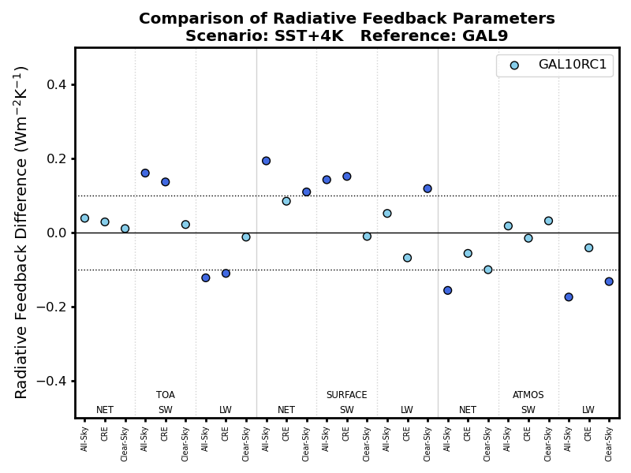
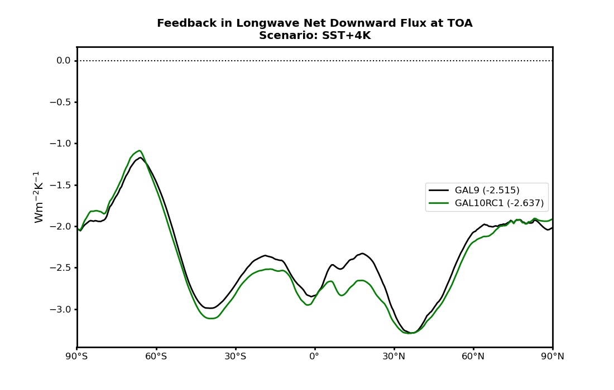

.. _recipes_radiation:

.. include:: ../../common.txt

Radiation
=========

This assessment is available via |AutoAssess|.

Overview
--------

Radiative feedback

Available recipes and diagnostics
---------------------------------

The assessment code is available from the `AutoAssess`_ repository.

User settings in recipe
-----------------------

There are no user settings for this recipe

Variables
---------

* tas (atmos, annual mean, longitude latitude time)
* rsns (atmos, annual mean, longitude latitude time)
* rsnt (atmos, annual mean, longitude latitude time)  (rsdt - rsut?)
* rlns (atmos, annual mean, longitude latitude time)
* rlnt (atmos, annual mean, longitude latitude time)  (0.0 - rlut?)
* rsnscs (atmos, annual mean, longitude latitude time)
* rsntcs (atmos, annual mean, longitude latitude time)
* rlnscs (atmos, annual mean, longitude latitude time)
* rlntcs (atmos, annual mean, longitude latitude time)

Observations and reformat scripts
---------------------------------

There are no observations used in this recipe.

References
----------

There is no reference for this recipe.

Example plots
-------------

   Radiatve feedback summary

   Zonal mean radiative feedback for Net Downward Longwave Radiation at TOA
