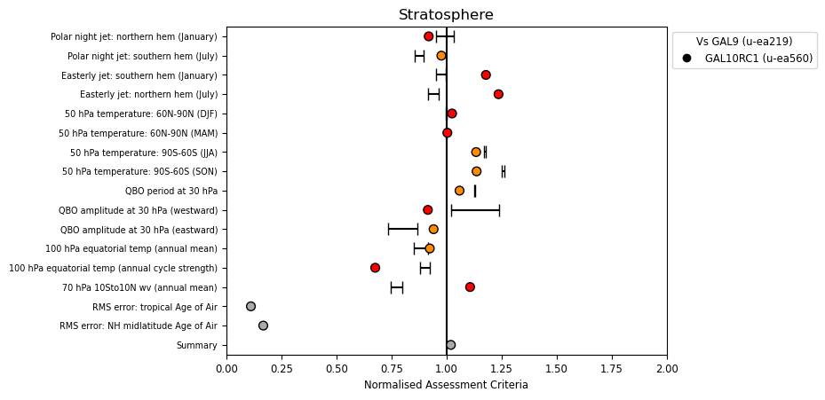
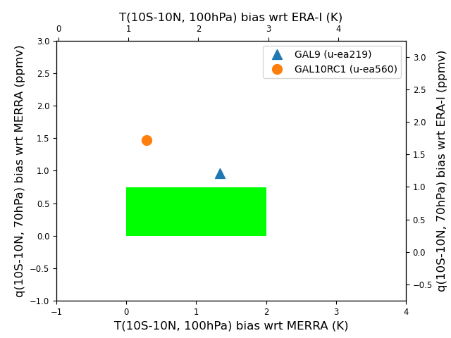
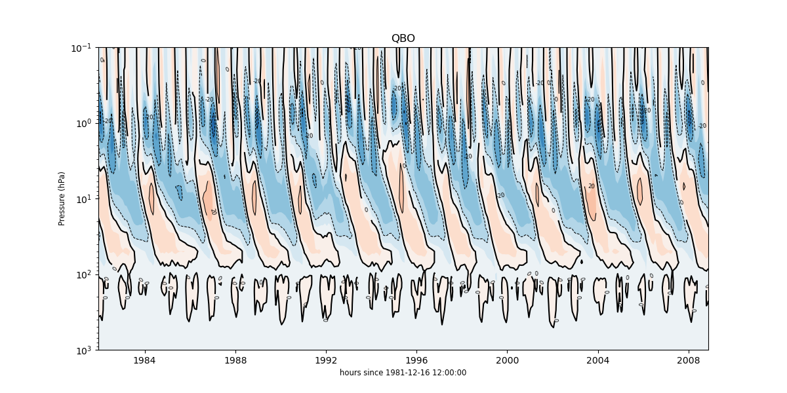
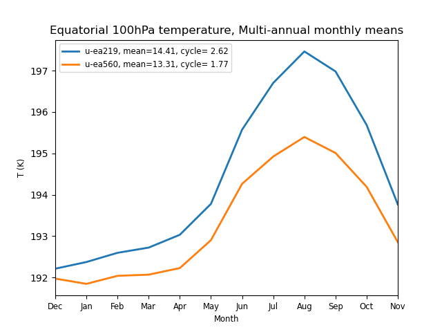
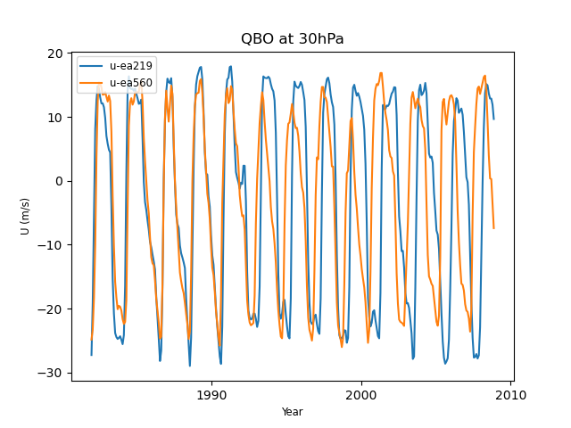
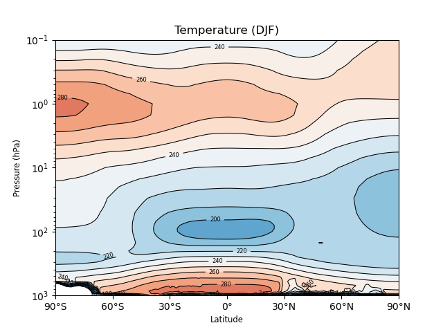
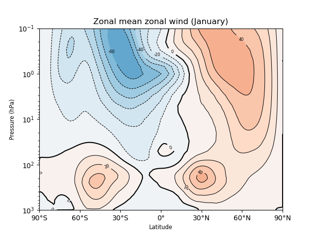
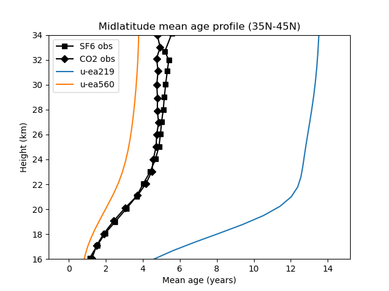
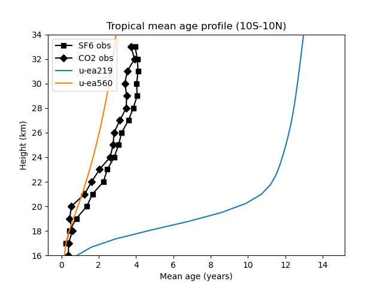

.. _recipes_stratosphere:

.. include:: ../../common.txt

Stratosphere
============

This recipe is available via |AutoAssess|.

Overview
--------

Polar night jet / easterly jet strengths are defined as the maximum / minimum wind
speed of the climatological zonal mean jet, and measure how realistic the zonal
wind climatology is in the stratosphere.

Extratropical temperature at 50hPa (area averaged poleward of 60 degrees) is important
for polar stratospheric cloud formation (in winter/spring), determining the amount of
heterogeneous ozone depletion simulated by models with interactive chemistry schemes.

The Quasi-Biennial Oscillation (QBO) is a good measure of tropical variability in the
stratosphere.  Zonal mean zonal wind at 30hPa is used to define the period and amplitude
of the QBO.

The tropical tropopause cold point (100hPa, 10S-10N) temperature is an important factor in
determining the stratospheric water vapour concentrations at entry point (70hPa, 10S-10N),
and this in turn is important for the accurate simulation of stratospheric chemistry and
radiative balance.

Available recipes and diagnostics
---------------------------------

The assessment code is available from the `AutoAssess`_ repository.

Note that the `Stratosphere`_ recipe has already been migrated to ESMValTool as
an example of the process of migrating AutoAssess assessments.

Performance metrics:

* Polar night jet: northern hem (January) vs. ERA Interim
* Polar night jet: southern hem (July) vs. ERA Interim
* Easterly jet: southern hem (January) vs. ERA Interim
* Easterly jet: northern hem (July) vs. ERA Interim
* 50 hPa temperature: 60N-90N (DJF) vs. ERA Interim
* 50 hPa temperature: 60N-90N (MAM) vs. ERA Interim
* 50 hPa temperature: 90S-60S (JJA) vs. ERA Interim
* 50 hPa temperature: 90S-60S (SON) vs. ERA Interim
* QBO period at 30 hPa vs. ERA Interim
* QBO amplitude at 30 hPa (westward) vs. ERA Interim
* QBO amplitude at 30 hPa (eastward) vs. ERA Interim
* 100 hPa equatorial temp (annual mean) vs. ERA Interim
* 100 hPa equatorial temp (annual cycle strength) vs. ERA Interim
* 70 hPa 10S-10N water vapour (annual mean) vs. ERA-Interim

Diagnostic plot:

* Age of stratospheric air vs. observations from Andrews et al. (2001) and Engel et al. (2009)

User settings in recipe
-----------------------

There are no user settings for this recipe

Variables
---------

* ua (atmos, monthly mean, longitude latitude pressure time)
* ta (atmos, monthly mean, longitude latitude pressure time)
* hus (atmos, monthly mean, longitude latitude pressure time)
* "age of air" (atmos, monthly mean, longitude latitude height time)

===========================   ================== ============== ==============================================
Variable/Field name           realm              frequency      Comment
===========================   ================== ============== ==============================================
Zonal mean zonal wind         Atmosphere         monthly mean
Zonal mean temperature        Atmosphere         monthly mean
Age of stratospheric air      Atmosphere         monthly mean
===========================   ================== ============== ==============================================

Observations and reformat scripts
---------------------------------

* ERA-Interim (ta, hus)
* MERRA (ta, hus)
* "Age of Air" sources?

ERA-Interim data (Dee et al., 2011) and MERRA data (Rienecker et al., 2011) can be obtained online from ECMWF and NASA respectively.  Monthly mean zonal mean U and T data are required.

Age of air data (Andrews et al., 2001; Engel et al., 2009) is as provided in age_of_air.py of the stratospheric area of auto_assess.

References
----------

* Andrews, A. E., and Coauthors, 2001: Mean ages of stratospheric air derived from in situ observations of CO2, CH4, and N2O. J. Geophys. Res.,   106 (D23), 32295-32314.
* Dee, D. P., and Coauthors, 2011: The ERA-Interim reanalysis: configuration and performance of the data assimilation system. Q. J. R. Meteorol.  Soc, 137, 553-597, doi:10.1002/qj.828.
* Engel, A., and Coauthors, 2009: Age of stratospheric air unchanged within uncertainties over the past 30 years. Nat. Geosci., 2, 28-31, doi:10  .1038/NGEO388.
* Rienecker, M. M., and Coauthors, 2011: MERRA: NASA’s Modern-Era Retrospective Analysis for Research and Applications. J. Climate, 24, 3624-3648, doi:http://dx.doi.org/10.1175/JCLI-D-11-00015.1.

Example plots
-------------

   Summary overview of metrics from the Stratosphere assessment.

   Comparison of temperature and humidity against re-analysis.

   Height-Timeseries of QBO

   Equatorial temperature at 100hPa, multi-annual monthly means

   QBO at 30hPa comparison

   Zonal mean temperature

   Zonal mean zonal wind

   Age of Air in Mid-Latitudes

   Age of Air in the Tropics
