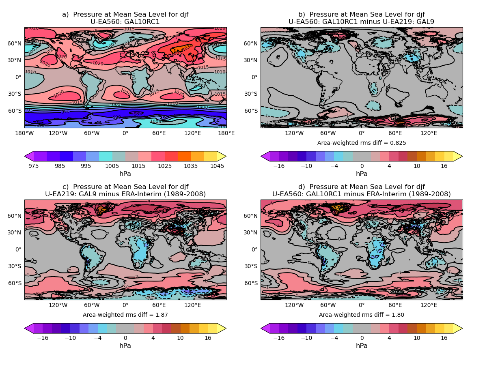
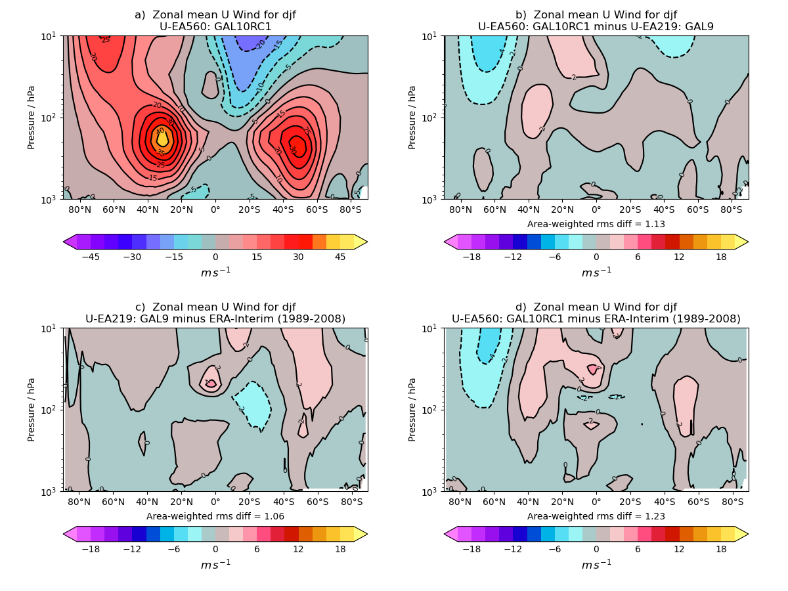
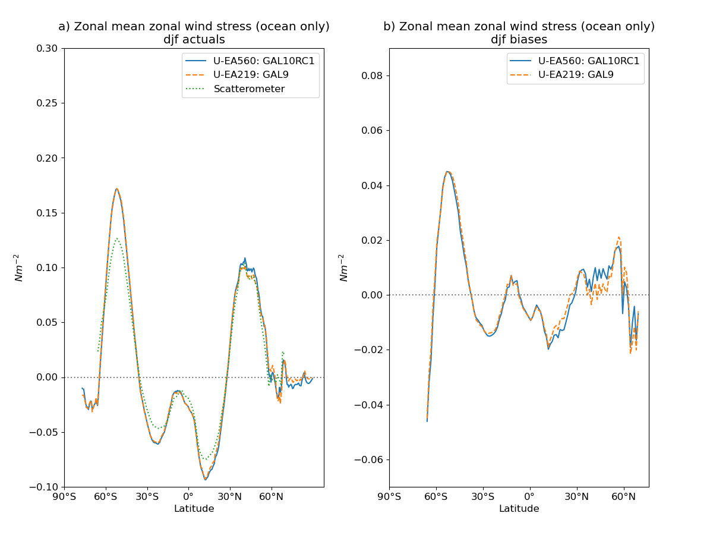
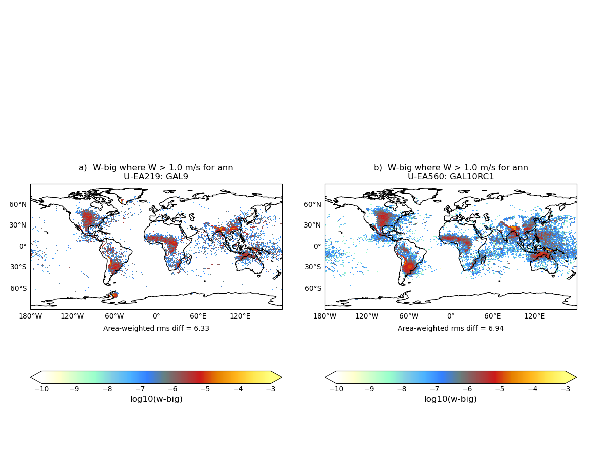

.. _recipes_valnote:

.. include:: ../../common.txt

Validation Note
===============

This recipe is available via |AutoAssess|.

Overview
--------

This is a generic assessment that can use a large number of model diagnostics and
compares two experiments with an appropriate observation for context. The general
diagnostic plot is a "4up" showing:

a. Reference field
b. Experiment - Reference difference
c. Reference - Observation difference
d. Experiment - Observation difference

If the model diagnostic does not lend itself to this format then other variations
plot can be used, see examples.

Available recipes and diagnostics
---------------------------------

The assessment code is available from the `AutoAssess`_ repository.

User settings in recipe
-----------------------

There are no user settings for this recipe

Variables
---------

Any available model diagnostic as either an annual or seasonal multi-annual mean.

Observations and reformat scripts
---------------------------------

A large number of observations are used for this assessment and are appropriate
for the model diagnostic being compared.

References
----------

There are no references for this assessment

Example plots
-------------

   Comparison of PMSL to ERA-Interim

   Comparison of zonal mean zonal wind to ERA-Interim using log(pressure) Y axis

   Comparison of surface wind stress to scatterometer

   Comparison of instances of vertical velocities > 1 ms-1
