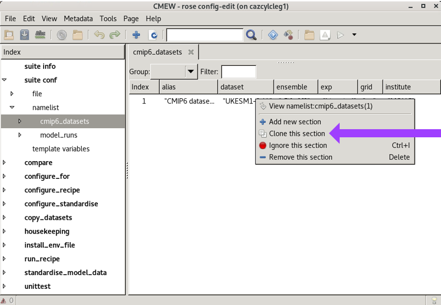

.. (C) Crown Copyright 2026, Met Office.
.. The LICENSE.md file contains full licensing details.

Adding Datasets to CMEW
=======================

.. include:: ../common.txt

The easiest way to add datasets to |CMEW| is to clone an existing dataset in the Rose GUI
and then edit the details. To do this:

* Navigate to the CMEW directory, or the "add datasets" app wthin |CMEW| e.g.::

    cd CMEW/CMEW

* Open the Rose GUI::

    rose edit

* In the Rose GUI, click the triangle to the left of "add_datasets" to expand the app.

* Click the triangle to the left of "namelist" to expand the namelist sections.

* Select the type of dataset you wish to add, e.g. "cmip6_datasets".

* Right-click an existing entry and select "Clone this section" from the pop-up menu.

         and the "namelist" section of the app expanded,
         the cmip6_datasets section of the namelist selected,
         and a pop-up menu over the first entry.
   :width: 600px

* Overwrite the details with those of the new dataset to be added.
