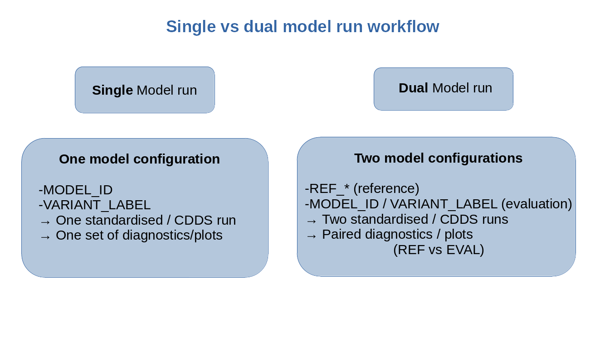
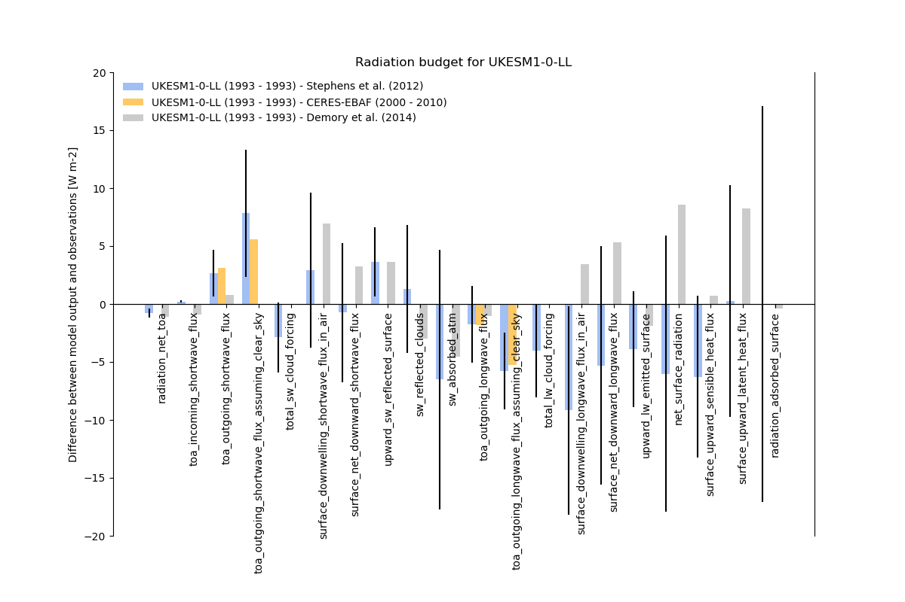

# (C) Crown Copyright 2026, Met Office.
# The LICENSE.md file contains full licensing details.

==========================================================
CMEW Dual-Run Capability (REF vs Evaluation) - Issue 142
==========================================================

Overview
========

The CMEW workflow now supports **two-model runs**:

* A **reference** model (``REF_MODEL_ID`` + metadata)
* An **evaluation** model (``MODEL_ID`` + metadata)

Both runs are passed through:

* :code:`configure_standardise`
* :code:`standardise_model_data`
* :code:`run_recipe <recipe>`

ESMValTool now receives two dataset entries inside the recipe, enabling comparative diagnostics and plots.

This work integrates changes from Issues :code:`#285`, :code:`#286`, and :code:`#287`.

Key Concepts
============

Dual-run processing means that CMEW performs the following:

1. Builds **two request files** for CDDS extraction (REF and EVAL).
2. Runs CDDS **twice** during standardisation.
3. Injects **two datasets** into the ESMValTool recipe.
4. Produces plots showing **side-by-side model behaviour**.
5. Maintains complete provenance for both runs.

This enables reproducible model intercomparison inside CMEW.

Environment Variables Introduced
================================

The following variables must be defined in :code:`rose-suite.conf`::

    REF_MODEL_ID        = ""
    REF_VARIANT_LABEL   = ""
    REF_SUITE_ID        = ""
    REF_CALENDAR        = ""

    MODEL_ID            = ""
    VARIANT_LABEL       = ""
    SUITE_ID            = ""
    CALENDAR            = ""

These are exported automatically to task environments via the ``MODEL_RUNS`` family.

Workflow Logic
==============

High-level flow
----------------

.. image:: ../_static/dual_run/single_vs_dual_model_run_workflow.png
   :alt: Dual vs Single Run Data Flow Diagram
   :align: center
   :width: 95%

Metadata propagation
--------------------

Modifications Introduced
========================

configure_standardise
---------------------

* Generates two request files:

  * ``request_ref.cfg``
  * ``request_eval.cfg``

* Calls CDDS request generation twice via:

  * ``create_request_file.py`` using REF metadata
  * ``create_request_file.py`` using EVAL metadata

standardise_model_data
----------------------

Executes CDDS twice, once for each run.

Each CDDS invocation places processed data under::

    share/data/cdds/proc/<model_id>/<run_label>/
    share/data/cdds/cdds_data/<model_id>/<run_label>/

configure_for + update_recipe_file.py
-------------------------------------

This module now:

* Updates **dataset[0]** using ``REF_MODEL_ID`` and ``REF_VARIANT_LABEL``.
* Updates **dataset[1]** using ``MODEL_ID`` and ``VARIANT_LABEL``.
* Forces:

  * project = ``ESMVal``
  * exp     = ``amip`` (eval only)
  * activity = ``ESMVal`` (eval only)
  * Correct time window based on start/end year.

The resulting recipe is written to:

``share/etc/recipe_<recipe>.yml``

Example Output in Recipe
========================

The two dataset entries appear like this:

.. code-block:: yaml

    datasets:
      - dataset: HadGEM3-GC31-LL
        project: ESMVal
        ensemble: r1i1p1f3
        exp: amip
        activity: ESMVal
        start_year: 1993
        end_year: 1993

      - dataset: UKESM1-0-LL
        project: ESMVal
        ensemble: r1i1p1f1
        exp: amip
        activity: ESMVal
        start_year: 1993
        end_year: 1993

Generated Plots
===============

Plots are produced in::

    share/cycle/<cycle_id>/recipe_<recipe>/plots/<diagnostic>/<script>/png/

Example:

``UKESM1-0-LL.png``
``HadGEM3-GC31-LL.png``

.. image:: ../_static/dual_run/HadGEM3-GC31-LL.png
   :width: 90%
   :align: center
   :alt: Plot for UKESM1-0-LL

``UKESM1-0-LL.png``
``HadGEM3-GC31-LL.png``

These show the reference vs evaluation for each radiation budget variable.

Unit Tests Added
================

The following test areas were introduced:

* ``test_update_recipe_file.py``
  Ensures datasets contain correct model and variant metadata.

* ``test_create_request_file.py``
  Validates metadata injection for REF and EVAL CDDS requests.

* ``test_standardise_model_data.py`` (lightweight)
  Confirms two CDDS calls would be made.

These tests ensure correctness of metadata propagation and dual-run behaviour.

Extending to N Model Runs
=========================

CMEW is now structured such that dual-run support could be extended to **N** runs.

Benefits:

* Multi-model ensemble validation
* Batch comparison of model branches
* Reproducible comparative diagnostics

Costs:

* Linearly increased CDDS compute time
* Increased disk usage
* More ESMValTool runs or more datasets per recipe

Current CMEW implementation supports **2** runs only (REF + EVAL).

Summary
=======

CMEW now supports:

* CDDS extraction for REF and EVAL
* Dual-run ESMValTool recipes
* Fully automated comparative diagnostics
* Complete provenance for both model datasets

This capability represents a significant enhancement to model development workflows.
