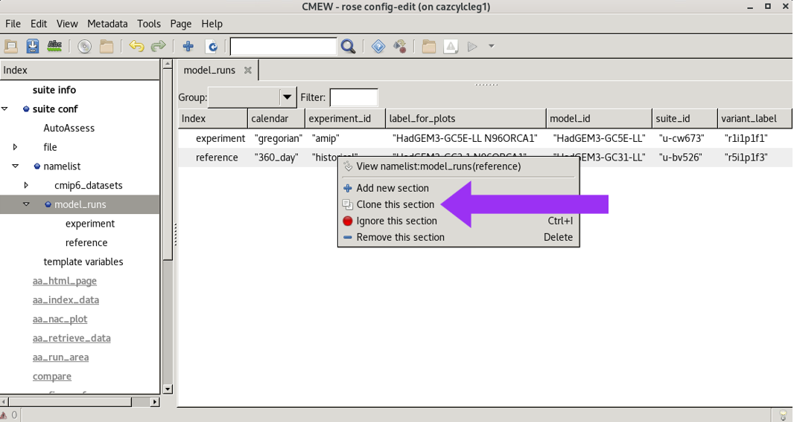
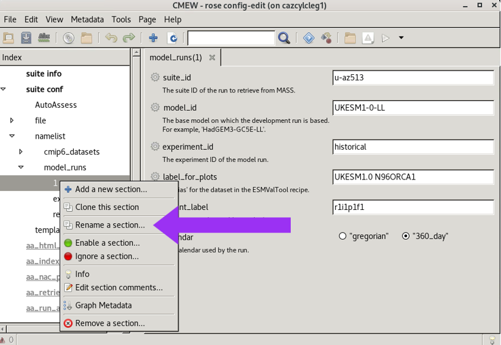
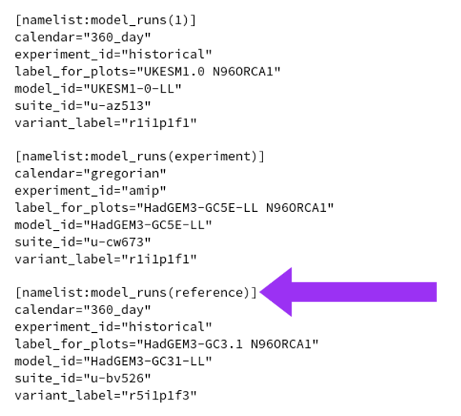

.. (C) Crown Copyright 2026, Met Office.
.. The LICENSE.md file contains full licensing details.

Configuring Datasets in CMEW
============================

.. include:: ../common.txt

Adding datasets
---------------

The easiest way to add datasets to |CMEW| is to clone an existing dataset in the Rose GUI
and then edit the details. To do this:

* Navigate to the CMEW directory, e.g.::

    cd CMEW/CMEW

* Open the Rose GUI::

    rose edit

* In the Rose GUI, click the triangle to the left of "suite conf" to expose a submenu.

* Click the triangle to the left of "namelist" to expand the namelist sections.

* Select the type of dataset you wish to add, e.g. "model_runs".

* Right-click an existing entry and select "Clone this section" from the pop-up menu.

         with the "namelist" section expanded,
         the model_runs section of the namelist selected,
         and a pop-up menu over the second entry.
   :width: 800px

* Overwrite the details with those of the new dataset to be added.

Choosing the reference dataset
------------------------------

AutoAssess metrics expect a reference and an evaluation run.
|CMEW| identifies these by the names of the model run sections in the ``rose-suite.conf`` file;
the reference run must be named **reference** and the evaluation run named **experiment**.
Any additional runs will be ignored by AutoAssess
but will be passed to the ESMValTool recipes in exactly the same way as the evaluation run "experiment".
These runs may be named as any other string.
If the clone button is used, the default is "1", "2" and so on.

Once a new dataset has been added, it may be named as the reference (or evaluation) run by

* Navigating to the "model_runs" area of the namelists.

* Right-clicking the entry to be amended (renamed).

* Clicking the "Rename a section" button.

There is currently no way to select a CMIP dataset as the reference (or evaluation) run
so these sections may be named in any way with no effects.

         with an arrow pointing to the option "Rename a section".
   :width: 600px

These changes may also be made directly to the ``rose-suite.conf`` file
rather than using the Rose GUI.

         with an arrow pointing to the section header "namelist:model_runs(reference)".
   :width: 300px

.. warning::
   Currently, the recipe "Radiation Budget" will not allow two datasets
   (such as both a CMIP6 dataset and a model development run)
   that share a common model ID (such as "HadGEM3-GC31-LL")
   to be run in the same workflow.
