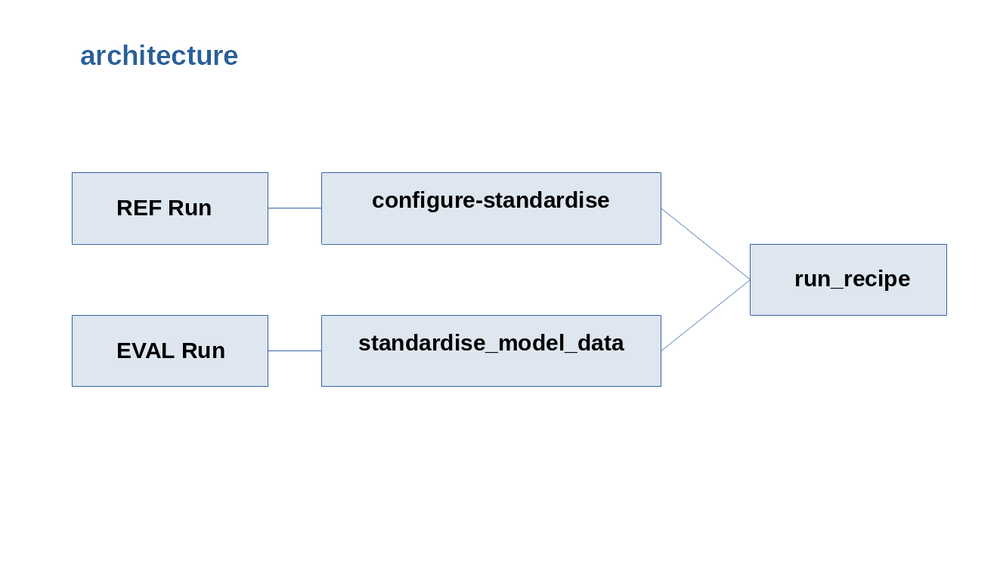
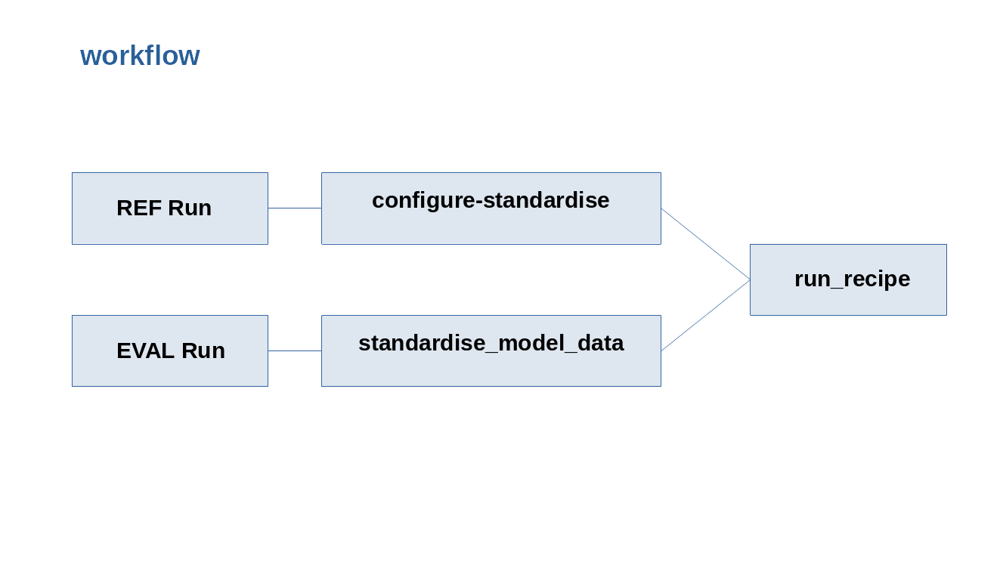

# (C) Crown Copyright 2026, Met Office.
# The LICENSE.md file contains full licensing details.

CMEW Dual Run Processing
========================

Overview
--------

CMEW now supports **dual model run evaluation**: a *reference* (REF_*) model
and an *evaluation* (MODEL_*) model are processed through CDDS and ESMValTool
in the same workflow cycle. This capability allows rapid comparison of two
model development runs under a unified, automated pipeline.

Key Features
------------

* Two complete CDDS standardisation runs (REF and EVAL)
* Two request files generated by configure_standardise
* One updated recipe containing two datasets
* Unified execution of ESMValTool
* Output plots generated for both runs and stored under ``share/cycle/.../plots``

Workflow Summary
----------------

1. **configure_standardise**
   Creates:
   - ``request_ref.cfg``
   - ``request_eval.cfg``
   Also injects REF/EVAL metadata into the environment.

2. **standardise_model_data**
   Runs CDDS twice:
   - with REF_* metadata
   - with MODEL_* metadata

3. **configure_for → update_recipe_file.py**
   Updates the recipe so that:

   - Dataset 0 = REF_MODEL_ID / REF_VARIANT_LABEL
   - Dataset 1 = MODEL_ID / VARIANT_LABEL

4. **run_recipe**
   Runs ESMValTool on the augmented recipe.

Output Locations
----------------

Plots are generated under::

    cylc-run/<workflow>/<run>/share/cycle/<cycle>/recipe_<name>/plots/

Example::

    plots/single_value_radiation_budget/radiation_budget/png/HadGEM3-GC31-LL.png
    plots/single_value_radiation_budget/radiation_budget/png/UKESM1-0-LL.png

Comparison: single vs dual model run
------------------------------------

The figure below summarises how the dual-model workflow extends the
original single-model capability. The left-hand side shows the previous
behaviour (one model, one standardisation run, one set of diagnostics),
while the right-hand side shows the new dual-run behaviour (one reference
run plus one evaluation run, both passed through CDDS and into ESMValTool).

.. image:: ../_static/dual_run/single_vs_dual_model_run_workflow.png
   :width: 90%
   :align: center
   :alt: Comparison of single and dual model run workflows
