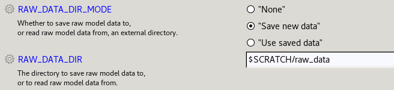

.. (C) Crown Copyright 2026, Met Office.
.. The LICENSE.md file contains full licensing details.

Reusing pre-extracted raw data files from MASS
==============================================

.. include:: ../common.txt

It is possible to save non-standardised model output data (e.g. pp files) with |CMEW|,
to avoid having to extract them from MASS again in future.

This functionality is controlled by two variables in the `rose-suite.conf` file:

         "RAW_DATA_DIR_FUNCTION" and "RAW_DATA_DIR"
   :width: 600px

To copy the data, the user must run |CMEW| specifying the location to which to save the files,
e.g.::

    RAW_DATA_DIR_FUNCTION="Save new data"
    RAW_DATA_DIR="$SCRATCH/raw_data"

The raw data files will be stored in subdirectories according to their suite ID,
and within these to their stream (e.g. "apm").

.. warning::
   If the suite ID's subdirectory in the specified parent directory is not empty,
   |CMEW| will deliberately fail to copy the data.

In future runs, to avoid extracting the same data,
specify the same location when skipping the extract from MASS step::

    RAW_DATA_DIR_FUNCTION="Use saved data"
    RAW_DATA_DIR="$SCRATCH/raw_data"

.. note::
   If only some of the necessary raw data files have already been extracted,
   for example data for one model run but not for another,
   then it is **not currently possible** to reuse raw data files with |CMEW|.
