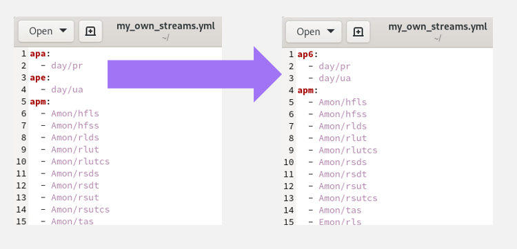
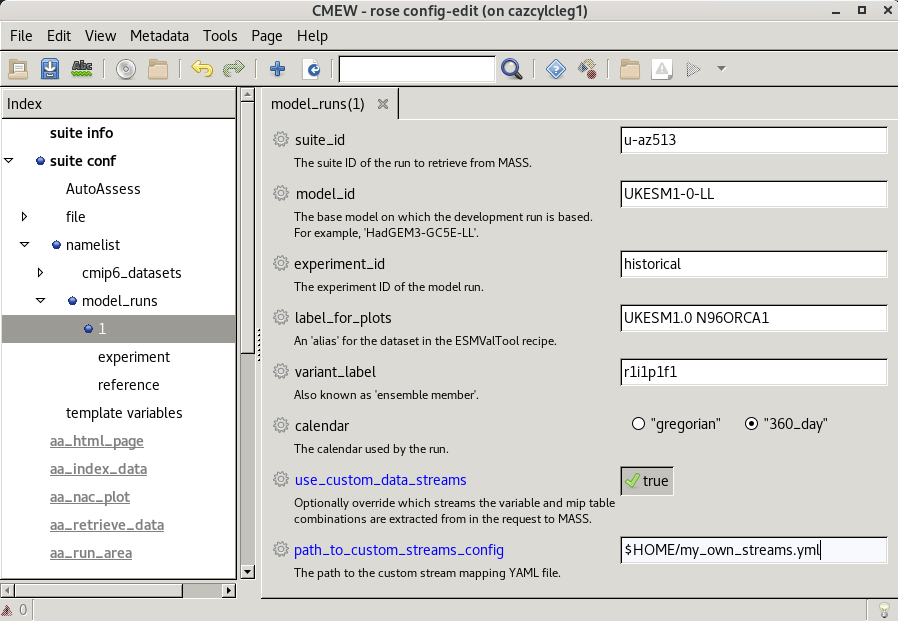

.. (C) Crown Copyright 2026, Met Office.
.. The LICENSE.md file contains full licensing details.

Using model runs with data in different streams
===============================================

.. include:: ../common.txt

Some model development runs may have been set up to store raw data on MASS in streams other than |CMEW|'s default.
To retrieve data in these circumstances, the user must provide a path to the stream mappings as a YAML file,
with keys for each data stream (such as ``apm``) followed by a list of every variable and mip table combination found in that stream,
in the format ``<mip_table>/<variable>``, e.g. ``Amon/tas``.

Inspecting |CMEW|'s stream assumptions
--------------------------------------

The default streams as expected by |CMEW| can be seen in the file ``CMEW/app/configure_standardise/etc/streams.yml``.

Providing alternative stream information
----------------------------------------

Stream information other than the default must be provided at a dataset level
and cover all variables required by the |CMEW| run.

The easiest way to do this is the following:

* Copy the default stream configuration file, e.g.::

    cp ./CMEW/CMEW/app/configure_standardise/etc/streams.yml $HOME/my_own_streams.yml

* Make any necessary changes to the file ``$HOME/my_own_streams.yml``, e.g.

         key ``apa`` followed on the next line by a hyphen, space, then the string ``day/pr``, then
         key ``ape`` followed on the next line by a hyphen, space, then the string ``day/ua``.
         The second editor has
         key ``ap6`` followed on the next line by a hyphen, space, then the string ``day/pr``, then
         on the next line a hyphen, space, then the string ``day/ua`` without an extra key in between.
   :width: 500px

* Change two variables in the ``model_runs`` dataset to use this custom path, either in the ``rose-suite.conf`` file or the Rose GUI, e.g.::

    use_custom_data_streams=true
    path_to_custom_streams_config="$HOME/my_own_streams.yml"

         ``use_custom_data_streams`` set to ``true` and
         ``path_to_custom_streams_config`` set to ``$HOME/my_own_streams.yml``
   :width: 800px

* Save the changes and run |CMEW|.
